# 25 个开放权重 LLM 架构家族 Mermaid 计算流程图

## 01. Qwen2 / Qwen2.5 Dense

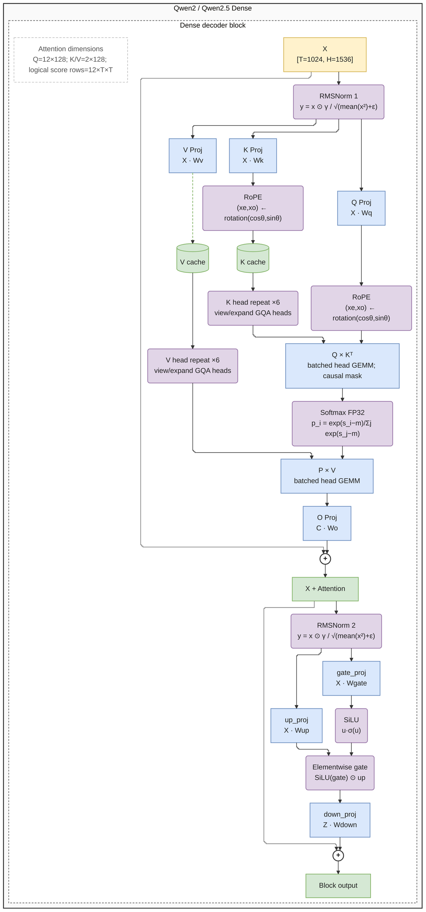

## 02. Qwen3 Dense

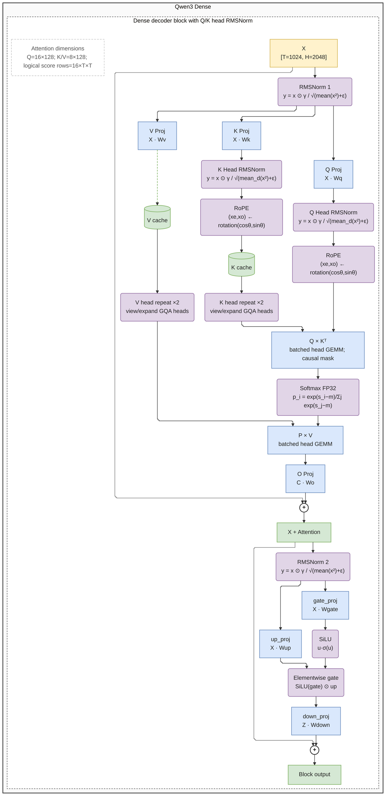

## 03. Llama / Yi / SmolLM Dense


## 04. Qwen3.5 / Qwen3.6 Hybrid MoE

```mermaid
%%{init: {"flowchart": {"defaultRenderer": "elk", "curve": "stepAfter", "htmlLabels": true, "nodeSpacing": 36, "rankSpacing": 48, "useMaxWidth": false}, "theme": "base"}}%%
%% Family rank 4: Qwen3.5 / Qwen3.6 Hybrid MoE
%% 06_Qwen3.5_MoE_GDN: 同构/同拓扑模型 | Qwen3.5-35B-A3B, Qwen3.6-35B-A3B, Ornith-1.0-35B and coder-next/quantized variants.
%% 07_Qwen3.5_MoE_FullAttention: 同构/同拓扑模型 | Same models as the MoE-GDN page; 3:1 GDN/full-attention layer pattern.
flowchart TB
  subgraph family_04["Qwen3.5 / Qwen3.6 Hybrid MoE"]
    direction TB
    subgraph variant_04_01["GDN + routed/shared MoE block"]
      direction TB
      subgraph p07_g01["Chunk Gated Delta Rule — expanded logical prefill dataflow"]
        direction TB
        p07_n040["Token-equivalent recurrence<br/>r_t = v_t − k_tᵀS_{t−1}<br/>S_t = α_tS_{t−1}+β_t k_t r_tᵀ<br/>o_t = q_tᵀS_t"]:::note
        p07_n041("Chunk partition<br/>T=1024; representative C=64"):::other
        p07_n042("Decay matrix Γ<br/>Γij = exp(Σr=j+1..i g_r)"):::other
        p07_n043["K Kᵀ<br/>batched head GEMM"]:::mac
        p07_n044("Build strict-lower L<br/>L = I + tril(β·Γ·KKᵀ, −1)"):::other
        p07_n045("Triangular solve<br/>U = L⁻¹(β ⊙ V)"):::other
        p07_n046["Q Kᵀ<br/>batched head GEMM"]:::mac
        p07_n047["Intra-chunk output<br/>Ointra=(Γ⊙QKᵀ)·U"]:::mac
        p07_n048["State read<br/>Ostate = Q · Sin"]:::mac
        p07_n049("Output combine<br/>O = Ostate + Ointra"):::other
        p07_n053[("Recurrent state S<br/>[heads,dK,dV] FP32")]:::state
        p07_n050["Kᵀ U<br/>state-delta GEMM"]:::mac
        p07_n051("State decay<br/>Sdecay = αend ⊙ Sin"):::other
        p07_n052((+)):::plus
      end
      subgraph p07_g02["Shared expert body × 1"]
        direction LR
        p07_n012["gate_proj<br/>X · Wg"]:::mac
        p07_n013["up_proj<br/>X · Wu"]:::mac
        p07_n014("SiLU<br/>u·σ(u)"):::other
        p07_n015("Elementwise gate<br/>SiLU(gate) ⊙ up"):::other
        p07_n016["down_proj<br/>Z · Wd"]:::mac
      end
      subgraph p07_g03["Routed expert body × E=256; 8 active/token"]
        direction LR
        p07_n004["gate_proj<br/>X · Wg"]:::mac
        p07_n005["up_proj<br/>X · Wu"]:::mac
        p07_n006("SiLU<br/>u·σ(u)"):::other
        p07_n007("Elementwise gate<br/>SiLU(gate) ⊙ up"):::other
        p07_n008["down_proj<br/>Z · Wd"]:::mac
      end
      p07_n001["X<br/>[T=1024, H=2048]"]:::input
      p07_n009("RMSNorm 1<br/>y = x ⊙ γ / √(mean(x²)+ε)"):::other
      p07_n017["in_proj_qkv<br/>X · Wqkv"]:::mac
      p07_n021["in_proj_z<br/>X · Wz"]:::mac
      p07_n025["in_proj_a<br/>X · Wa"]:::mac
      p07_n026["in_proj_b<br/>X · Wb"]:::mac
      p07_n027("Depthwise Conv1D<br/>causal, k=4; channelwise"):::other
      p07_n030("Decay preactivation<br/>g = −exp(A_log)·softplus(a+dt_bias)"):::other
      p07_n028("SiLU<br/>u·σ(u)"):::other
      p07_n031("Decay factor<br/>α = exp(g)"):::other
      p07_n032("Update gate<br/>β = sigmoid(b)"):::other
      p07_n029("Split Q / K / V<br/>reshape mixed projection into three tensors"):::other
      p07_n033("Q reshape<br/>[16,T,128]"):::other
      p07_n034("K reshape<br/>[16,T,128]"):::other
      p07_n035("V reshape<br/>[32,T,128]"):::other
      p07_n036("Q head repeat ×2<br/>repeat_interleave to V-head count"):::other
      p07_n037("K head repeat ×2<br/>repeat_interleave to V-head count"):::other
      p07_n038("Q L2Norm<br/>x̂ = x / max(‖x‖₂, ε)"):::other
      p07_n039("K L2Norm<br/>x̂ = x / max(‖x‖₂, ε)"):::other
      p07_n054("RMSNormGated<br/>Y = RMSNorm(O) ⊙ SiLU(z)"):::other
      p07_n055["out_proj<br/>Y · Wout"]:::mac
      p07_n056((+)):::plus
      p07_n057["X + GDN"]:::output
      p07_n058("RMSNorm 2<br/>y = x ⊙ γ / √(mean(x²)+ε)"):::other
      p07_n059["Router projection<br/>logits = X · Wrouter"]:::mac
      p07_n060("Router scoring<br/>p = softmax_FP32(logits)"):::other
      p07_n002("Top-8 + renorm<br/>select experts; p ← p/ΣTopK p"):::other
      p07_n003("Dispatch / gather<br/>group token rows by expert_id"):::other
      p07_n018["Shared gate projection<br/>s = X · ws"]:::mac
      p07_n019("Sigmoid<br/>σ(s)"):::other
      p07_n020("Shared gating<br/>σ(s) ⊙ Eshared(X)"):::other
      p07_n010("Expert weighting<br/>p_e ⊙ E_e(X)"):::other
      p07_n011("Scatter / weighted reduce<br/>Yroute = Σe p_e E_e(X)"):::other
      p07_n022((+)):::plus
      p07_n023((+)):::plus
      p07_n024["Block output"]:::output
      p07_n001 --> p07_n009
      p07_n009 --> p07_n017
      p07_n009 --> p07_n021
      p07_n009 --> p07_n025
      p07_n009 --> p07_n026
      p07_n017 --> p07_n027
      p07_n027 --> p07_n028
      p07_n028 --> p07_n029
      p07_n025 --> p07_n030
      p07_n030 --> p07_n031
      p07_n026 --> p07_n032
      p07_n029 --> p07_n033
      p07_n029 --> p07_n034
      p07_n029 --> p07_n035
      p07_n033 --> p07_n036
      p07_n034 --> p07_n037
      p07_n036 --> p07_n038
      p07_n037 --> p07_n039
      p07_n031 --> p07_n042
      p07_n038 --> p07_n041
      p07_n039 --> p07_n041
      p07_n035 --> p07_n041
      p07_n041 --> p07_n043
      p07_n043 --> p07_n044
      p07_n032 --> p07_n044
      p07_n042 --> p07_n044
      p07_n044 --> p07_n045
      p07_n041 --> p07_n046
      p07_n046 --> p07_n047
      p07_n042 --> p07_n047
      p07_n045 --> p07_n047
      p07_n038 --> p07_n048
      p07_n047 --> p07_n049
      p07_n048 --> p07_n049
      p07_n041 --> p07_n050
      p07_n045 --> p07_n050
      p07_n042 --> p07_n051
      p07_n050 --> p07_n052
      p07_n051 --> p07_n052
      p07_n052 -.-> p07_n053
      p07_n053 -.-> p07_n048
      p07_n053 -.-> p07_n051
      p07_n049 --> p07_n054
      p07_n021 --> p07_n054
      p07_n054 --> p07_n055
      p07_n055 --> p07_n056
      p07_n001 --> p07_n056
      p07_n056 --> p07_n057
      p07_n057 --> p07_n058
      p07_n004 --> p07_n006
      p07_n006 --> p07_n007
      p07_n005 --> p07_n007
      p07_n007 --> p07_n008
      p07_n058 --> p07_n059
      p07_n059 --> p07_n060
      p07_n060 --> p07_n002
      p07_n002 --> p07_n003
      p07_n003 --> p07_n004
      p07_n003 --> p07_n005
      p07_n008 --> p07_n010
      p07_n002 --> p07_n010
      p07_n010 --> p07_n011
      p07_n012 --> p07_n014
      p07_n014 --> p07_n015
      p07_n013 --> p07_n015
      p07_n015 --> p07_n016
      p07_n058 --> p07_n012
      p07_n058 --> p07_n013
      p07_n058 --> p07_n018
      p07_n018 --> p07_n019
      p07_n019 --> p07_n020
      p07_n016 --> p07_n020
      p07_n011 --> p07_n022
      p07_n020 --> p07_n022
      p07_n022 --> p07_n023
      p07_n023 --> p07_n024
      p07_n057 --> p07_n023
    end
    subgraph variant_04_02["Gated full-attention + routed/shared MoE block"]
      direction TB
      subgraph p08_g01["Shared expert body × 1"]
        direction LR
        p08_n038["gate_proj<br/>X · Wg"]:::mac
        p08_n039["up_proj<br/>X · Wu"]:::mac
        p08_n040("SiLU<br/>u·σ(u)"):::other
        p08_n041("Elementwise gate<br/>SiLU(gate) ⊙ up"):::other
        p08_n042["down_proj<br/>Z · Wd"]:::mac
      end
      subgraph p08_g02["Routed expert body × E=256; 8 active/token"]
        direction LR
        p08_n031["gate_proj<br/>X · Wg"]:::mac
        p08_n032["up_proj<br/>X · Wu"]:::mac
        p08_n033("SiLU<br/>u·σ(u)"):::other
        p08_n034("Elementwise gate<br/>SiLU(gate) ⊙ up"):::other
        p08_n035["down_proj<br/>Z · Wd"]:::mac
      end
      p08_n001["X<br/>[T=1024, H=2048]"]:::input
      p08_n006("RMSNorm 1<br/>y = x ⊙ γ / √(mean(x²)+ε)"):::other
      p08_n007["K Proj<br/>X · Wk"]:::mac
      p08_n008["Q Proj + gate<br/>X · Wq"]:::mac
      p08_n009["V Proj<br/>X · Wv"]:::mac
      p08_n010("K Head RMSNorm<br/>y = x ⊙ γ / √(mean_d(x²)+ε)"):::other
      p08_n011("Q Head RMSNorm<br/>y = x ⊙ γ / √(mean_d(x²)+ε)"):::other
      p08_n012("Partial RoPE<br/>rotate first 0.25·d dims; pass rest"):::other
      p08_n013("Partial RoPE<br/>rotate first 0.25·d dims; pass rest"):::other
      p08_n014[("K cache")]:::state
      p08_n015[("V cache")]:::state
      p08_n016("K head repeat ×8<br/>view/expand GQA heads"):::other
      p08_n017("V head repeat ×8<br/>view/expand GQA heads"):::other
      p08_n018["Q × Kᵀ<br/>batched head GEMM; causal mask"]:::mac
      p08_n019("Softmax FP32<br/>p_i = exp(s_i−m)/Σj exp(s_j−m)"):::other
      p08_n021("Q-gate sigmoid<br/>gq = σ(q_gate)"):::other
      p08_n020["P × V<br/>batched head GEMM"]:::mac
      p08_n022("Context gating<br/>C ← C ⊙ gq"):::other
      p08_n023["O Proj<br/>C · Wo"]:::mac
      p08_n024((+)):::plus
      p08_n025["X + Attention"]:::output
      p08_n026("RMSNorm 2<br/>y = x ⊙ γ / √(mean(x²)+ε)"):::other
      p08_n027["Router projection<br/>logits = X · Wrouter"]:::mac
      p08_n028("Router scoring<br/>p = softmax_FP32(logits)"):::other
      p08_n029("Top-8 + renorm<br/>select experts; p ← p/ΣTopK p"):::other
      p08_n030("Dispatch / gather<br/>group token rows by expert_id"):::other
      p08_n043["Shared gate projection<br/>s = X · ws"]:::mac
      p08_n044("Sigmoid<br/>σ(s)"):::other
      p08_n045("Shared gating<br/>σ(s) ⊙ Eshared(X)"):::other
      p08_n036("Expert weighting<br/>p_e ⊙ E_e(X)"):::other
      p08_n037("Scatter / weighted reduce<br/>Yroute = Σe p_e E_e(X)"):::other
      p08_n002((+)):::plus
      p08_n003((+)):::plus
      p08_n005["Attention dimensions<br/>Q=16×256; K/V=2×256; logical score rows=16×T×T"]:::note
      p08_n004["Block output"]:::output
      p08_n001 --> p08_n006
      p08_n006 --> p08_n007
      p08_n006 --> p08_n008
      p08_n006 --> p08_n009
      p08_n007 --> p08_n010
      p08_n008 --> p08_n011
      p08_n010 --> p08_n012
      p08_n011 --> p08_n013
      p08_n012 --> p08_n014
      p08_n009 -.-> p08_n015
      p08_n014 --> p08_n016
      p08_n015 --> p08_n017
      p08_n013 --> p08_n018
      p08_n016 --> p08_n018
      p08_n018 --> p08_n019
      p08_n019 --> p08_n020
      p08_n017 --> p08_n020
      p08_n008 --> p08_n021
      p08_n020 --> p08_n022
      p08_n021 --> p08_n022
      p08_n022 --> p08_n023
      p08_n023 --> p08_n024
      p08_n001 --> p08_n024
      p08_n024 --> p08_n025
      p08_n025 --> p08_n026
      p08_n031 --> p08_n033
      p08_n033 --> p08_n034
      p08_n032 --> p08_n034
      p08_n034 --> p08_n035
      p08_n026 --> p08_n027
      p08_n027 --> p08_n028
      p08_n028 --> p08_n029
      p08_n029 --> p08_n030
      p08_n030 --> p08_n031
      p08_n030 --> p08_n032
      p08_n035 --> p08_n036
      p08_n029 --> p08_n036
      p08_n036 --> p08_n037
      p08_n038 --> p08_n040
      p08_n040 --> p08_n041
      p08_n039 --> p08_n041
      p08_n041 --> p08_n042
      p08_n026 --> p08_n038
      p08_n026 --> p08_n039
      p08_n026 --> p08_n043
      p08_n043 --> p08_n044
      p08_n044 --> p08_n045
      p08_n042 --> p08_n045
      p08_n037 --> p08_n002
      p08_n045 --> p08_n002
      p08_n002 --> p08_n003
      p08_n003 --> p08_n004
      p08_n025 --> p08_n003
    end
  end
style family_04 fill:#fafafa,stroke:#333333,stroke-width:2px;
style p07_g01 fill:#ffffff,stroke:#999999,stroke-width:1px,stroke-dasharray:6 4;
style p07_g02 fill:#ffffff,stroke:#999999,stroke-width:1px,stroke-dasharray:6 4;
style p07_g03 fill:#ffffff,stroke:#999999,stroke-width:1px,stroke-dasharray:6 4;
style variant_04_01 fill:#ffffff,stroke:#666666,stroke-width:1.5px,stroke-dasharray:4 3;
style p08_g01 fill:#ffffff,stroke:#999999,stroke-width:1px,stroke-dasharray:6 4;
style p08_g02 fill:#ffffff,stroke:#999999,stroke-width:1px,stroke-dasharray:6 4;
style variant_04_02 fill:#ffffff,stroke:#666666,stroke-width:1.5px,stroke-dasharray:4 3;

classDef mac fill:#dae8fc,stroke:#6c8ebf,stroke-width:1.5px,color:#1f1f1f;
classDef other fill:#e1d5e7,stroke:#9673a6,stroke-width:1.5px,color:#1f1f1f;
classDef state fill:#d5e8d4,stroke:#82b366,stroke-width:1.5px,color:#1f1f1f;
classDef output fill:#d5e8d4,stroke:#82b366,stroke-width:1.5px,color:#1f1f1f;
classDef input fill:#fff2cc,stroke:#d6b656,stroke-width:1.5px,color:#1f1f1f;
classDef input2 fill:#ffe6cc,stroke:#d79b00,stroke-width:1.5px,color:#1f1f1f;
classDef weight fill:#f8cecc,stroke:#b85450,stroke-width:1.5px,color:#1f1f1f;
classDef plus fill:#ffffff,stroke:#333333,stroke-width:2px,color:#111111,font-weight:bold;
classDef note fill:#ffffff,stroke:#b3b3b3,stroke-width:1px,stroke-dasharray:5 3,color:#555555;
classDef neutral fill:#ffffff,stroke:#777777,stroke-width:1.2px,color:#333333;
linkStyle default stroke:#333333,stroke-width:1.2px;
linkStyle 39,40,41,86 stroke:#82b366,stroke-width:1.5px,stroke-dasharray:5 3;
linkStyle 46,76,99,129 stroke:#777777,stroke-width:1.3px;

```

## 05. Qwen3 MoE

```mermaid
%%{init: {"flowchart": {"defaultRenderer": "elk", "curve": "stepAfter", "htmlLabels": true, "nodeSpacing": 36, "rankSpacing": 48, "useMaxWidth": false}, "theme": "base"}}%%
%% Family rank 5: Qwen3 MoE
%% 04_Qwen3_MoE: 同构/同拓扑模型 | Qwen3-30B-A3B, Qwen3-Coder-30B-A3B, their instruct/FP8/GGUF/AWQ variants; text blocks of Qwen3-VL-30B-A3B are isomorphic.
flowchart TB
  subgraph family_05["Qwen3 MoE"]
    direction TB
    subgraph variant_05_01["Full attention + routed MoE block"]
      direction TB
      subgraph p04_g01["Routed expert body × E=128; 8 active/token"]
        direction LR
        p04_n025["gate_proj<br/>X · Wg"]:::mac
        p04_n026["up_proj<br/>X · Wu"]:::mac
        p04_n027("SiLU<br/>u·σ(u)"):::other
        p04_n028("Elementwise gate<br/>SiLU(gate) ⊙ up"):::other
        p04_n029["down_proj<br/>Z · Wd"]:::mac
      end
      p04_n001["X<br/>[T=1024, H=2048]"]:::input
      p04_n002("RMSNorm 1<br/>y = x ⊙ γ / √(mean(x²)+ε)"):::other
      p04_n003["K Proj<br/>X · Wk"]:::mac
      p04_n004["Q Proj<br/>X · Wq"]:::mac
      p04_n005["V Proj<br/>X · Wv"]:::mac
      p04_n006("K Head RMSNorm<br/>y = x ⊙ γ / √(mean_d(x²)+ε)"):::other
      p04_n007("Q Head RMSNorm<br/>y = x ⊙ γ / √(mean_d(x²)+ε)"):::other
      p04_n008("RoPE<br/>(xe,xo) ← rotation(cosθ,sinθ)"):::other
      p04_n009("RoPE<br/>(xe,xo) ← rotation(cosθ,sinθ)"):::other
      p04_n010[("K cache")]:::state
      p04_n011[("V cache")]:::state
      p04_n012("K head repeat ×8<br/>view/expand GQA heads"):::other
      p04_n013("V head repeat ×8<br/>view/expand GQA heads"):::other
      p04_n014["Q × Kᵀ<br/>batched head GEMM; causal mask"]:::mac
      p04_n015("Softmax FP32<br/>p_i = exp(s_i−m)/Σj exp(s_j−m)"):::other
      p04_n016["P × V<br/>batched head GEMM"]:::mac
      p04_n017["O Proj<br/>C · Wo"]:::mac
      p04_n018((+)):::plus
      p04_n019["X + Attention"]:::output
      p04_n020("RMSNorm 2<br/>y = x ⊙ γ / √(mean(x²)+ε)"):::other
      p04_n021["Router projection<br/>logits = X · Wrouter"]:::mac
      p04_n022("Router scoring<br/>p = softmax_FP32(logits)"):::other
      p04_n023("Top-8 + renorm<br/>select experts; p ← p/ΣTopK p"):::other
      p04_n024("Dispatch / gather<br/>group token rows by expert_id"):::other
      p04_n030("Expert weighting<br/>p_e ⊙ E_e(X)"):::other
      p04_n031("Scatter / weighted reduce<br/>Yroute = Σe p_e E_e(X)"):::other
      p04_n032((+)):::plus
      p04_n034["Attention dimensions<br/>Q=32×128; K/V=4×128; logical score rows=32×T×T"]:::note
      p04_n033["Block output"]:::output
      p04_n001 --> p04_n002
      p04_n002 --> p04_n003
      p04_n002 --> p04_n004
      p04_n002 --> p04_n005
      p04_n003 --> p04_n006
      p04_n004 --> p04_n007
      p04_n006 --> p04_n008
      p04_n007 --> p04_n009
      p04_n008 --> p04_n010
      p04_n005 -.-> p04_n011
      p04_n010 --> p04_n012
      p04_n011 --> p04_n013
      p04_n009 --> p04_n014
      p04_n012 --> p04_n014
      p04_n014 --> p04_n015
      p04_n015 --> p04_n016
      p04_n013 --> p04_n016
      p04_n016 --> p04_n017
      p04_n017 --> p04_n018
      p04_n001 --> p04_n018
      p04_n018 --> p04_n019
      p04_n019 --> p04_n020
      p04_n025 --> p04_n027
      p04_n027 --> p04_n028
      p04_n026 --> p04_n028
      p04_n028 --> p04_n029
      p04_n020 --> p04_n021
      p04_n021 --> p04_n022
      p04_n022 --> p04_n023
      p04_n023 --> p04_n024
      p04_n024 --> p04_n025
      p04_n024 --> p04_n026
      p04_n029 --> p04_n030
      p04_n023 --> p04_n030
      p04_n030 --> p04_n031
      p04_n031 --> p04_n032
      p04_n032 --> p04_n033
      p04_n019 --> p04_n032
    end
  end
style family_05 fill:#fafafa,stroke:#333333,stroke-width:2px;
style p04_g01 fill:#ffffff,stroke:#999999,stroke-width:1px,stroke-dasharray:6 4;
style variant_05_01 fill:#ffffff,stroke:#666666,stroke-width:1.5px,stroke-dasharray:4 3;

classDef mac fill:#dae8fc,stroke:#6c8ebf,stroke-width:1.5px,color:#1f1f1f;
classDef other fill:#e1d5e7,stroke:#9673a6,stroke-width:1.5px,color:#1f1f1f;
classDef state fill:#d5e8d4,stroke:#82b366,stroke-width:1.5px,color:#1f1f1f;
classDef output fill:#d5e8d4,stroke:#82b366,stroke-width:1.5px,color:#1f1f1f;
classDef input fill:#fff2cc,stroke:#d6b656,stroke-width:1.5px,color:#1f1f1f;
classDef input2 fill:#ffe6cc,stroke:#d79b00,stroke-width:1.5px,color:#1f1f1f;
classDef weight fill:#f8cecc,stroke:#b85450,stroke-width:1.5px,color:#1f1f1f;
classDef plus fill:#ffffff,stroke:#333333,stroke-width:2px,color:#111111,font-weight:bold;
classDef note fill:#ffffff,stroke:#b3b3b3,stroke-width:1px,stroke-dasharray:5 3,color:#555555;
classDef neutral fill:#ffffff,stroke:#777777,stroke-width:1.2px,color:#333333;
linkStyle default stroke:#333333,stroke-width:1.2px;
linkStyle 9 stroke:#82b366,stroke-width:1.5px,stroke-dasharray:5 3;
linkStyle 19,37 stroke:#777777,stroke-width:1.3px;

```

## 06. GPT-2 Dense

```mermaid
%%{init: {"flowchart": {"defaultRenderer": "elk", "curve": "stepAfter", "htmlLabels": true, "nodeSpacing": 36, "rankSpacing": 48, "useMaxWidth": false}, "theme": "base"}}%%
%% Family rank 6: GPT-2 Dense
%% 08_GPT2_Dense: 同构/同拓扑模型 | GPT-2 small/medium/large/XL, DistilGPT2 and tiny-gpt2 preserve the combined-QKV, pre-LN, absolute-position, GELU-MLP block topology.
flowchart TB
  subgraph family_06["GPT-2 Dense"]
    direction TB
    subgraph variant_06_01["GPT-2 pre-norm dense block"]
      direction TB
      p09_n001["X<br/>[T=1024, H=768]"]:::input
      p09_n002("Learned absolute position<br/>X ← token_embed + pos_embed"):::other
      p09_n003("LayerNorm 1<br/>y = γ⊙(x−μ)/√(σ²+ε)+β"):::other
      p09_n004["Combined QKV Proj<br/>X · Wqkv + bqkv"]:::mac
      p09_n005("Split heads<br/>reshape Q/K/V"):::other
      p09_n006["Q × Kᵀ<br/>MHA score GEMM + causal mask"]:::mac
      p09_n007("Softmax FP32<br/>p_i=exp(s_i−m)/Σexp(s_j−m)"):::other
      p09_n008["P × V<br/>batched head GEMM"]:::mac
      p09_n009["Output Proj<br/>C·Wo+bo"]:::mac
      p09_n010((+)):::plus
      p09_n011["X + Attention"]:::output
      p09_n012("LayerNorm 2<br/>y = γ⊙(x−μ)/√(σ²+ε)+β"):::other
      p09_n013["fc1<br/>X · W1 + b1"]:::mac
      p09_n014("GELU<br/>GELU(x)"):::other
      p09_n015["fc2<br/>A · W2 + b2"]:::mac
      p09_n016((+)):::plus
      p09_n017["Block output"]:::output
      p09_n001 --> p09_n002
      p09_n002 --> p09_n003
      p09_n003 --> p09_n004
      p09_n004 --> p09_n005
      p09_n005 --> p09_n006
      p09_n005 --> p09_n006
      p09_n006 --> p09_n007
      p09_n007 --> p09_n008
      p09_n005 --> p09_n008
      p09_n008 --> p09_n009
      p09_n009 --> p09_n010
      p09_n002 --> p09_n010
      p09_n010 --> p09_n011
      p09_n011 --> p09_n012
      p09_n012 --> p09_n013
      p09_n013 --> p09_n014
      p09_n014 --> p09_n015
      p09_n015 --> p09_n016
      p09_n016 --> p09_n017
      p09_n011 --> p09_n016
    end
  end
style family_06 fill:#fafafa,stroke:#333333,stroke-width:2px;
style variant_06_01 fill:#ffffff,stroke:#666666,stroke-width:1.5px,stroke-dasharray:4 3;

classDef mac fill:#dae8fc,stroke:#6c8ebf,stroke-width:1.5px,color:#1f1f1f;
classDef other fill:#e1d5e7,stroke:#9673a6,stroke-width:1.5px,color:#1f1f1f;
classDef state fill:#d5e8d4,stroke:#82b366,stroke-width:1.5px,color:#1f1f1f;
classDef output fill:#d5e8d4,stroke:#82b366,stroke-width:1.5px,color:#1f1f1f;
classDef input fill:#fff2cc,stroke:#d6b656,stroke-width:1.5px,color:#1f1f1f;
classDef input2 fill:#ffe6cc,stroke:#d79b00,stroke-width:1.5px,color:#1f1f1f;
classDef weight fill:#f8cecc,stroke:#b85450,stroke-width:1.5px,color:#1f1f1f;
classDef plus fill:#ffffff,stroke:#333333,stroke-width:2px,color:#111111,font-weight:bold;
classDef note fill:#ffffff,stroke:#b3b3b3,stroke-width:1px,stroke-dasharray:5 3,color:#555555;
classDef neutral fill:#ffffff,stroke:#777777,stroke-width:1.2px,color:#333333;
linkStyle default stroke:#333333,stroke-width:1.2px;
linkStyle 11,19 stroke:#777777,stroke-width:1.3px;

```

## 07. OPT Dense

```mermaid
%%{init: {"flowchart": {"defaultRenderer": "elk", "curve": "stepAfter", "htmlLabels": true, "nodeSpacing": 36, "rankSpacing": 48, "useMaxWidth": false}, "theme": "base"}}%%
%% Family rank 7: OPT Dense
%% 09_OPT_Dense: 同构/同拓扑模型 | OPT 125M through 175B keep the same learned-position, separate-QKV, pre-LN attention and ReLU FFN topology; dimensions differ.
flowchart TB
  subgraph family_07["OPT Dense"]
    direction TB
    subgraph variant_07_01["OPT pre-norm dense block"]
      direction TB
      p10_n001["X<br/>[T=1024, H=768]"]:::input
      p10_n002("Learned absolute position<br/>X ← token_embed + pos_embed"):::other
      p10_n003("LayerNorm 1<br/>y = γ⊙(x−μ)/√(σ²+ε)+β"):::other
      p10_n004["Q Proj<br/>X·Wq+bq"]:::mac
      p10_n005["K Proj<br/>X·Wk+bk"]:::mac
      p10_n006["V Proj<br/>X·Wv+bv"]:::mac
      p10_n007["Q × Kᵀ<br/>MHA score GEMM + causal mask"]:::mac
      p10_n008("Softmax FP32<br/>p_i=exp(s_i−m)/Σexp(s_j−m)"):::other
      p10_n009["P × V<br/>batched head GEMM"]:::mac
      p10_n010["Output Proj<br/>C·Wo+bo"]:::mac
      p10_n011((+)):::plus
      p10_n012["X + Attention"]:::output
      p10_n013("LayerNorm 2<br/>y = γ⊙(x−μ)/√(σ²+ε)+β"):::other
      p10_n014["fc1<br/>X · W1 + b1"]:::mac
      p10_n015("ReLU<br/>max(x,0)"):::other
      p10_n016["fc2<br/>A · W2 + b2"]:::mac
      p10_n017((+)):::plus
      p10_n018["Block output"]:::output
      p10_n001 --> p10_n002
      p10_n002 --> p10_n003
      p10_n003 --> p10_n004
      p10_n003 --> p10_n005
      p10_n003 --> p10_n006
      p10_n004 --> p10_n007
      p10_n005 --> p10_n007
      p10_n007 --> p10_n008
      p10_n008 --> p10_n009
      p10_n006 --> p10_n009
      p10_n009 --> p10_n010
      p10_n010 --> p10_n011
      p10_n002 --> p10_n011
      p10_n011 --> p10_n012
      p10_n012 --> p10_n013
      p10_n013 --> p10_n014
      p10_n014 --> p10_n015
      p10_n015 --> p10_n016
      p10_n016 --> p10_n017
      p10_n017 --> p10_n018
      p10_n012 --> p10_n017
    end
  end
style family_07 fill:#fafafa,stroke:#333333,stroke-width:2px;
style variant_07_01 fill:#ffffff,stroke:#666666,stroke-width:1.5px,stroke-dasharray:4 3;

classDef mac fill:#dae8fc,stroke:#6c8ebf,stroke-width:1.5px,color:#1f1f1f;
classDef other fill:#e1d5e7,stroke:#9673a6,stroke-width:1.5px,color:#1f1f1f;
classDef state fill:#d5e8d4,stroke:#82b366,stroke-width:1.5px,color:#1f1f1f;
classDef output fill:#d5e8d4,stroke:#82b366,stroke-width:1.5px,color:#1f1f1f;
classDef input fill:#fff2cc,stroke:#d6b656,stroke-width:1.5px,color:#1f1f1f;
classDef input2 fill:#ffe6cc,stroke:#d79b00,stroke-width:1.5px,color:#1f1f1f;
classDef weight fill:#f8cecc,stroke:#b85450,stroke-width:1.5px,color:#1f1f1f;
classDef plus fill:#ffffff,stroke:#333333,stroke-width:2px,color:#111111,font-weight:bold;
classDef note fill:#ffffff,stroke:#b3b3b3,stroke-width:1px,stroke-dasharray:5 3,color:#555555;
classDef neutral fill:#ffffff,stroke:#777777,stroke-width:1.2px,color:#333333;
linkStyle default stroke:#333333,stroke-width:1.2px;
linkStyle 12,20 stroke:#777777,stroke-width:1.3px;

```

## 08. Qwen3.5 / Qwen3.6 Hybrid Dense

```mermaid
%%{init: {"flowchart": {"defaultRenderer": "elk", "curve": "stepAfter", "htmlLabels": true, "nodeSpacing": 36, "rankSpacing": 48, "useMaxWidth": false}, "theme": "base"}}%%
%% Family rank 8: Qwen3.5 / Qwen3.6 Hybrid Dense
%% 05A_Qwen3.5_Dense_GDN: 同构/同拓扑模型 | Qwen3.5-2B, Ornith-1.0-9B, Bonsai/Ternary-Bonsai 27B, Qwen3.6/3.8 dense variants use the same GDN-vs-full-attention hybrid topology; dimensions differ.
%% 05B_Qwen3.5_Dense_FullAttention: 同构/同拓扑模型 | Same models as the GDN page; the stack normally interleaves 3 GDN blocks with 1 full-attention block.
flowchart TB
  subgraph family_08["Qwen3.5 / Qwen3.6 Hybrid Dense"]
    direction TB
    subgraph variant_08_01["GDN + dense SwiGLU block"]
      direction TB
      subgraph p05_g01["Chunk Gated Delta Rule — expanded logical prefill dataflow"]
        direction TB
        p05_n020["Token-equivalent recurrence<br/>r_t = v_t − k_tᵀS_{t−1}<br/>S_t = α_tS_{t−1}+β_t k_t r_tᵀ<br/>o_t = q_tᵀS_t"]:::note
        p05_n021("Chunk partition<br/>T=1024; representative C=64"):::other
        p05_n022("Decay matrix Γ<br/>Γij = exp(Σr=j+1..i g_r)"):::other
        p05_n023["K Kᵀ<br/>batched head GEMM"]:::mac
        p05_n024("Build strict-lower L<br/>L = I + tril(β·Γ·KKᵀ, −1)"):::other
        p05_n025("Triangular solve<br/>U = L⁻¹(β ⊙ V)"):::other
        p05_n026["Q Kᵀ<br/>batched head GEMM"]:::mac
        p05_n027["Intra-chunk output<br/>Ointra=(Γ⊙QKᵀ)·U"]:::mac
        p05_n028["State read<br/>Ostate = Q · Sin"]:::mac
        p05_n029("Output combine<br/>O = Ostate + Ointra"):::other
        p05_n033[("Recurrent state S<br/>[heads,dK,dV] FP32")]:::state
        p05_n030["Kᵀ U<br/>state-delta GEMM"]:::mac
        p05_n031("State decay<br/>Sdecay = αend ⊙ Sin"):::other
        p05_n032((+)):::plus
      end
      p05_n001["X<br/>[T=1024, H=2048]"]:::input
      p05_n004("RMSNorm 1<br/>y = x ⊙ γ / √(mean(x²)+ε)"):::other
      p05_n005["in_proj_qkv<br/>X · Wqkv"]:::mac
      p05_n006["in_proj_z<br/>X · Wz"]:::mac
      p05_n007["in_proj_a<br/>X · Wa"]:::mac
      p05_n008["in_proj_b<br/>X · Wb"]:::mac
      p05_n009("Depthwise Conv1D<br/>causal, k=4; channelwise"):::other
      p05_n012("Decay preactivation<br/>g = −exp(A_log)·softplus(a+dt_bias)"):::other
      p05_n010("SiLU<br/>u·σ(u)"):::other
      p05_n013("Decay factor<br/>α = exp(g)"):::other
      p05_n014("Update gate<br/>β = sigmoid(b)"):::other
      p05_n011("Split Q / K / V<br/>reshape mixed projection into three tensors"):::other
      p05_n015("Q reshape<br/>[16,T,128]"):::other
      p05_n016("K reshape<br/>[16,T,128]"):::other
      p05_n017("V reshape<br/>[16,T,128]"):::other
      p05_n018("Q L2Norm<br/>x̂ = x / max(‖x‖₂, ε)"):::other
      p05_n019("K L2Norm<br/>x̂ = x / max(‖x‖₂, ε)"):::other
      p05_n034("RMSNormGated<br/>Y = RMSNorm(O) ⊙ SiLU(z)"):::other
      p05_n035["out_proj<br/>Y · Wout"]:::mac
      p05_n036((+)):::plus
      p05_n037["X + GDN"]:::output
      p05_n038("RMSNorm 2<br/>y = x ⊙ γ / √(mean(x²)+ε)"):::other
      p05_n039["gate_proj<br/>X · Wgate"]:::mac
      p05_n040["up_proj<br/>X · Wup"]:::mac
      p05_n041("SiLU<br/>u·σ(u)"):::other
      p05_n042("Elementwise gate<br/>SiLU(gate) ⊙ up"):::other
      p05_n043["down_proj<br/>Z · Wdown"]:::mac
      p05_n002((+)):::plus
      p05_n003["Block output"]:::output
      p05_n001 --> p05_n004
      p05_n004 --> p05_n005
      p05_n004 --> p05_n006
      p05_n004 --> p05_n007
      p05_n004 --> p05_n008
      p05_n005 --> p05_n009
      p05_n009 --> p05_n010
      p05_n010 --> p05_n011
      p05_n007 --> p05_n012
      p05_n012 --> p05_n013
      p05_n008 --> p05_n014
      p05_n011 --> p05_n015
      p05_n011 --> p05_n016
      p05_n011 --> p05_n017
      p05_n015 --> p05_n018
      p05_n016 --> p05_n019
      p05_n013 --> p05_n022
      p05_n018 --> p05_n021
      p05_n019 --> p05_n021
      p05_n017 --> p05_n021
      p05_n021 --> p05_n023
      p05_n023 --> p05_n024
      p05_n014 --> p05_n024
      p05_n022 --> p05_n024
      p05_n024 --> p05_n025
      p05_n021 --> p05_n026
      p05_n026 --> p05_n027
      p05_n022 --> p05_n027
      p05_n025 --> p05_n027
      p05_n018 --> p05_n028
      p05_n027 --> p05_n029
      p05_n028 --> p05_n029
      p05_n021 --> p05_n030
      p05_n025 --> p05_n030
      p05_n022 --> p05_n031
      p05_n030 --> p05_n032
      p05_n031 --> p05_n032
      p05_n032 -.-> p05_n033
      p05_n033 -.-> p05_n028
      p05_n033 -.-> p05_n031
      p05_n029 --> p05_n034
      p05_n006 --> p05_n034
      p05_n034 --> p05_n035
      p05_n035 --> p05_n036
      p05_n001 --> p05_n036
      p05_n036 --> p05_n037
      p05_n037 --> p05_n038
      p05_n038 --> p05_n039
      p05_n038 --> p05_n040
      p05_n039 --> p05_n041
      p05_n041 --> p05_n042
      p05_n040 --> p05_n042
      p05_n042 --> p05_n043
      p05_n043 --> p05_n002
      p05_n002 --> p05_n003
      p05_n037 --> p05_n002
    end
    subgraph variant_08_02["Gated full-attention + dense SwiGLU block"]
      direction TB
      p06_n001["X<br/>[T=1024, H=2048]"]:::input
      p06_n002("RMSNorm 1<br/>y = x ⊙ γ / √(mean(x²)+ε)"):::other
      p06_n003["K Proj<br/>X · Wk"]:::mac
      p06_n004["Q Proj + gate<br/>X · Wq"]:::mac
      p06_n005["V Proj<br/>X · Wv"]:::mac
      p06_n006("K Head RMSNorm<br/>y = x ⊙ γ / √(mean_d(x²)+ε)"):::other
      p06_n007("Q Head RMSNorm<br/>y = x ⊙ γ / √(mean_d(x²)+ε)"):::other
      p06_n008("Partial RoPE<br/>rotate first 0.25·d dims; pass rest"):::other
      p06_n009("Partial RoPE<br/>rotate first 0.25·d dims; pass rest"):::other
      p06_n010[("K cache")]:::state
      p06_n011[("V cache")]:::state
      p06_n012("K head repeat ×4<br/>view/expand GQA heads"):::other
      p06_n013("V head repeat ×4<br/>view/expand GQA heads"):::other
      p06_n014["Q × Kᵀ<br/>batched head GEMM; causal mask"]:::mac
      p06_n015("Softmax FP32<br/>p_i = exp(s_i−m)/Σj exp(s_j−m)"):::other
      p06_n017("Q-gate sigmoid<br/>gq = σ(q_gate)"):::other
      p06_n016["P × V<br/>batched head GEMM"]:::mac
      p06_n018("Context gating<br/>C ← C ⊙ gq"):::other
      p06_n019["O Proj<br/>C · Wo"]:::mac
      p06_n020((+)):::plus
      p06_n021["X + Attention"]:::output
      p06_n022("RMSNorm 2<br/>y = x ⊙ γ / √(mean(x²)+ε)"):::other
      p06_n023["gate_proj<br/>X · Wgate"]:::mac
      p06_n024["up_proj<br/>X · Wup"]:::mac
      p06_n025("SiLU<br/>u·σ(u)"):::other
      p06_n026("Elementwise gate<br/>SiLU(gate) ⊙ up"):::other
      p06_n027["down_proj<br/>Z · Wdown"]:::mac
      p06_n028((+)):::plus
      p06_n029["Block output"]:::output
      p06_n030["Attention dimensions<br/>Q=8×256; K/V=2×256; logical score rows=8×T×T"]:::note
      p06_n001 --> p06_n002
      p06_n002 --> p06_n003
      p06_n002 --> p06_n004
      p06_n002 --> p06_n005
      p06_n003 --> p06_n006
      p06_n004 --> p06_n007
      p06_n006 --> p06_n008
      p06_n007 --> p06_n009
      p06_n008 --> p06_n010
      p06_n005 -.-> p06_n011
      p06_n010 --> p06_n012
      p06_n011 --> p06_n013
      p06_n009 --> p06_n014
      p06_n012 --> p06_n014
      p06_n014 --> p06_n015
      p06_n015 --> p06_n016
      p06_n013 --> p06_n016
      p06_n004 --> p06_n017
      p06_n016 --> p06_n018
      p06_n017 --> p06_n018
      p06_n018 --> p06_n019
      p06_n019 --> p06_n020
      p06_n001 --> p06_n020
      p06_n020 --> p06_n021
      p06_n021 --> p06_n022
      p06_n022 --> p06_n023
      p06_n022 --> p06_n024
      p06_n023 --> p06_n025
      p06_n025 --> p06_n026
      p06_n024 --> p06_n026
      p06_n026 --> p06_n027
      p06_n027 --> p06_n028
      p06_n028 --> p06_n029
      p06_n021 --> p06_n028
    end
  end
style family_08 fill:#fafafa,stroke:#333333,stroke-width:2px;
style p05_g01 fill:#ffffff,stroke:#999999,stroke-width:1px,stroke-dasharray:6 4;
style variant_08_01 fill:#ffffff,stroke:#666666,stroke-width:1.5px,stroke-dasharray:4 3;
style variant_08_02 fill:#ffffff,stroke:#666666,stroke-width:1.5px,stroke-dasharray:4 3;

classDef mac fill:#dae8fc,stroke:#6c8ebf,stroke-width:1.5px,color:#1f1f1f;
classDef other fill:#e1d5e7,stroke:#9673a6,stroke-width:1.5px,color:#1f1f1f;
classDef state fill:#d5e8d4,stroke:#82b366,stroke-width:1.5px,color:#1f1f1f;
classDef output fill:#d5e8d4,stroke:#82b366,stroke-width:1.5px,color:#1f1f1f;
classDef input fill:#fff2cc,stroke:#d6b656,stroke-width:1.5px,color:#1f1f1f;
classDef input2 fill:#ffe6cc,stroke:#d79b00,stroke-width:1.5px,color:#1f1f1f;
classDef weight fill:#f8cecc,stroke:#b85450,stroke-width:1.5px,color:#1f1f1f;
classDef plus fill:#ffffff,stroke:#333333,stroke-width:2px,color:#111111,font-weight:bold;
classDef note fill:#ffffff,stroke:#b3b3b3,stroke-width:1px,stroke-dasharray:5 3,color:#555555;
classDef neutral fill:#ffffff,stroke:#777777,stroke-width:1.2px,color:#333333;
linkStyle default stroke:#333333,stroke-width:1.2px;
linkStyle 37,38,39,65 stroke:#82b366,stroke-width:1.5px,stroke-dasharray:5 3;
linkStyle 44,55,78,89 stroke:#777777,stroke-width:1.3px;

```

## 09. GPT-OSS MoE

```mermaid
%%{init: {"flowchart": {"defaultRenderer": "elk", "curve": "stepAfter", "htmlLabels": true, "nodeSpacing": 36, "rankSpacing": 48, "useMaxWidth": false}, "theme": "base"}}%%
%% Family rank 9: GPT-OSS MoE
%% 10A_GPT_OSS_Sliding: 同构/同拓扑模型 | gpt-oss-20b and gpt-oss-120b share alternating sliding/full attention, learned attention sinks and top-4 MoE; layer count/expert dimensions differ.
%% 10B_GPT_OSS_Full: 同构/同拓扑模型 | Same GPT-OSS family; this is the alternating full-attention block.
flowchart TB
  subgraph family_09["GPT-OSS MoE"]
    direction TB
    subgraph variant_09_01["Sliding-attention + top-4 MoE block"]
      direction TB
      subgraph p11_g01["Routed expert body × E=32; 4 active/token"]
        direction LR
        p11_n023["gate_proj<br/>X · Wg"]:::mac
        p11_n024["up_proj<br/>X · Wu"]:::mac
        p11_n025("SiLU<br/>u·σ(u)"):::other
        p11_n026("Elementwise gate<br/>SiLU(gate) ⊙ up"):::other
        p11_n027["down_proj<br/>Z · Wd"]:::mac
      end
      p11_n001["X<br/>[T=1024, H=2880]"]:::input
      p11_n002("RMSNorm 1<br/>y = x ⊙ γ / √(mean(x²)+ε)"):::other
      p11_n003["K Proj<br/>X · Wk"]:::mac
      p11_n004["Q Proj<br/>X · Wq"]:::mac
      p11_n005["V Proj<br/>X · Wv"]:::mac
      p11_n006("RoPE<br/>(xe,xo) ← rotation(cosθ,sinθ)"):::other
      p11_n007("RoPE<br/>(xe,xo) ← rotation(cosθ,sinθ)"):::other
      p11_n008[("K cache")]:::state
      p11_n009[("V cache")]:::state
      p11_n010("K head repeat ×8<br/>view/expand GQA heads"):::other
      p11_n011("V head repeat ×8<br/>view/expand GQA heads"):::other
      p11_n012["Q × Kᵀ<br/>batched head GEMM; causal sliding window W=128"]:::mac
      p11_n013("Softmax FP32 + sink<br/>P = softmax([QKᵀ/√d, learned sink_head]); discard sink output"):::other
      p11_n014["P × V<br/>batched head GEMM"]:::mac
      p11_n015["O Proj<br/>C · Wo"]:::mac
      p11_n016((+)):::plus
      p11_n017["X + Attention"]:::output
      p11_n018("RMSNorm 2<br/>y = x ⊙ γ / √(mean(x²)+ε)"):::other
      p11_n019["Router projection<br/>logits = X · Wrouter"]:::mac
      p11_n020("Router scoring<br/>p = softmax_FP32(logits)"):::other
      p11_n021("Top-4 + renorm<br/>select experts; p ← p/ΣTopK p"):::other
      p11_n022("Dispatch / gather<br/>group token rows by expert_id"):::other
      p11_n028("Expert weighting<br/>p_e ⊙ E_e(X)"):::other
      p11_n029("Scatter / weighted reduce<br/>Yroute = Σe p_e E_e(X)"):::other
      p11_n030((+)):::plus
      p11_n032["Attention dimensions<br/>Q=64×64; K/V=8×64; logical score rows=64×T×128"]:::note
      p11_n031["Block output"]:::output
      p11_n001 --> p11_n002
      p11_n002 --> p11_n003
      p11_n002 --> p11_n004
      p11_n002 --> p11_n005
      p11_n003 --> p11_n006
      p11_n004 --> p11_n007
      p11_n006 --> p11_n008
      p11_n005 -.-> p11_n009
      p11_n008 --> p11_n010
      p11_n009 --> p11_n011
      p11_n007 --> p11_n012
      p11_n010 --> p11_n012
      p11_n012 --> p11_n013
      p11_n013 --> p11_n014
      p11_n011 --> p11_n014
      p11_n014 --> p11_n015
      p11_n015 --> p11_n016
      p11_n001 --> p11_n016
      p11_n016 --> p11_n017
      p11_n017 --> p11_n018
      p11_n023 --> p11_n025
      p11_n025 --> p11_n026
      p11_n024 --> p11_n026
      p11_n026 --> p11_n027
      p11_n018 --> p11_n019
      p11_n019 --> p11_n020
      p11_n020 --> p11_n021
      p11_n021 --> p11_n022
      p11_n022 --> p11_n023
      p11_n022 --> p11_n024
      p11_n027 --> p11_n028
      p11_n021 --> p11_n028
      p11_n028 --> p11_n029
      p11_n029 --> p11_n030
      p11_n030 --> p11_n031
      p11_n017 --> p11_n030
    end
    subgraph variant_09_02["Full-attention + top-4 MoE block"]
      direction TB
      subgraph p12_g01["Routed expert body × E=32; 4 active/token"]
        direction LR
        p12_n023["gate_proj<br/>X · Wg"]:::mac
        p12_n024["up_proj<br/>X · Wu"]:::mac
        p12_n025("SiLU<br/>u·σ(u)"):::other
        p12_n026("Elementwise gate<br/>SiLU(gate) ⊙ up"):::other
        p12_n027["down_proj<br/>Z · Wd"]:::mac
      end
      p12_n001["X<br/>[T=1024, H=2880]"]:::input
      p12_n002("RMSNorm 1<br/>y = x ⊙ γ / √(mean(x²)+ε)"):::other
      p12_n003["K Proj<br/>X · Wk"]:::mac
      p12_n004["Q Proj<br/>X · Wq"]:::mac
      p12_n005["V Proj<br/>X · Wv"]:::mac
      p12_n006("RoPE<br/>(xe,xo) ← rotation(cosθ,sinθ)"):::other
      p12_n007("RoPE<br/>(xe,xo) ← rotation(cosθ,sinθ)"):::other
      p12_n008[("K cache")]:::state
      p12_n009[("V cache")]:::state
      p12_n010("K head repeat ×8<br/>view/expand GQA heads"):::other
      p12_n011("V head repeat ×8<br/>view/expand GQA heads"):::other
      p12_n012["Q × Kᵀ<br/>batched head GEMM; causal mask"]:::mac
      p12_n013("Softmax FP32 + sink<br/>P = softmax([QKᵀ/√d, learned sink_head]); discard sink output"):::other
      p12_n014["P × V<br/>batched head GEMM"]:::mac
      p12_n015["O Proj<br/>C · Wo"]:::mac
      p12_n016((+)):::plus
      p12_n017["X + Attention"]:::output
      p12_n018("RMSNorm 2<br/>y = x ⊙ γ / √(mean(x²)+ε)"):::other
      p12_n019["Router projection<br/>logits = X · Wrouter"]:::mac
      p12_n020("Router scoring<br/>p = softmax_FP32(logits)"):::other
      p12_n021("Top-4 + renorm<br/>select experts; p ← p/ΣTopK p"):::other
      p12_n022("Dispatch / gather<br/>group token rows by expert_id"):::other
      p12_n028("Expert weighting<br/>p_e ⊙ E_e(X)"):::other
      p12_n029("Scatter / weighted reduce<br/>Yroute = Σe p_e E_e(X)"):::other
      p12_n030((+)):::plus
      p12_n032["Attention dimensions<br/>Q=64×64; K/V=8×64; logical score rows=64×T×T"]:::note
      p12_n031["Block output"]:::output
      p12_n001 --> p12_n002
      p12_n002 --> p12_n003
      p12_n002 --> p12_n004
      p12_n002 --> p12_n005
      p12_n003 --> p12_n006
      p12_n004 --> p12_n007
      p12_n006 --> p12_n008
      p12_n005 -.-> p12_n009
      p12_n008 --> p12_n010
      p12_n009 --> p12_n011
      p12_n007 --> p12_n012
      p12_n010 --> p12_n012
      p12_n012 --> p12_n013
      p12_n013 --> p12_n014
      p12_n011 --> p12_n014
      p12_n014 --> p12_n015
      p12_n015 --> p12_n016
      p12_n001 --> p12_n016
      p12_n016 --> p12_n017
      p12_n017 --> p12_n018
      p12_n023 --> p12_n025
      p12_n025 --> p12_n026
      p12_n024 --> p12_n026
      p12_n026 --> p12_n027
      p12_n018 --> p12_n019
      p12_n019 --> p12_n020
      p12_n020 --> p12_n021
      p12_n021 --> p12_n022
      p12_n022 --> p12_n023
      p12_n022 --> p12_n024
      p12_n027 --> p12_n028
      p12_n021 --> p12_n028
      p12_n028 --> p12_n029
      p12_n029 --> p12_n030
      p12_n030 --> p12_n031
      p12_n017 --> p12_n030
    end
  end
style family_09 fill:#fafafa,stroke:#333333,stroke-width:2px;
style p11_g01 fill:#ffffff,stroke:#999999,stroke-width:1px,stroke-dasharray:6 4;
style variant_09_01 fill:#ffffff,stroke:#666666,stroke-width:1.5px,stroke-dasharray:4 3;
style p12_g01 fill:#ffffff,stroke:#999999,stroke-width:1px,stroke-dasharray:6 4;
style variant_09_02 fill:#ffffff,stroke:#666666,stroke-width:1.5px,stroke-dasharray:4 3;

classDef mac fill:#dae8fc,stroke:#6c8ebf,stroke-width:1.5px,color:#1f1f1f;
classDef other fill:#e1d5e7,stroke:#9673a6,stroke-width:1.5px,color:#1f1f1f;
classDef state fill:#d5e8d4,stroke:#82b366,stroke-width:1.5px,color:#1f1f1f;
classDef output fill:#d5e8d4,stroke:#82b366,stroke-width:1.5px,color:#1f1f1f;
classDef input fill:#fff2cc,stroke:#d6b656,stroke-width:1.5px,color:#1f1f1f;
classDef input2 fill:#ffe6cc,stroke:#d79b00,stroke-width:1.5px,color:#1f1f1f;
classDef weight fill:#f8cecc,stroke:#b85450,stroke-width:1.5px,color:#1f1f1f;
classDef plus fill:#ffffff,stroke:#333333,stroke-width:2px,color:#111111,font-weight:bold;
classDef note fill:#ffffff,stroke:#b3b3b3,stroke-width:1px,stroke-dasharray:5 3,color:#555555;
classDef neutral fill:#ffffff,stroke:#777777,stroke-width:1.2px,color:#333333;
linkStyle default stroke:#333333,stroke-width:1.2px;
linkStyle 7,43 stroke:#82b366,stroke-width:1.5px,stroke-dasharray:5 3;
linkStyle 17,35,53,71 stroke:#777777,stroke-width:1.3px;

```

## 10. Gemma 4 Dense

```mermaid
%%{init: {"flowchart": {"defaultRenderer": "elk", "curve": "stepAfter", "htmlLabels": true, "nodeSpacing": 36, "rankSpacing": 48, "useMaxWidth": false}, "theme": "base"}}%%
%% Family rank 10: Gemma 4 Dense
%% 11A_Gemma4_Sliding: 同构/同拓扑模型 | Gemma-4-31B and OTel 31B/27B derivatives; five sliding blocks precede each full-attention block.
%% 11B_Gemma4_Full: 同构/同拓扑模型 | Same Gemma 4 dense family; global/full block uses 4 KV heads, 512-d heads and partial rotary factor 0.25.
flowchart TB
  subgraph family_10["Gemma 4 Dense"]
    direction TB
    subgraph variant_10_01["Sliding-attention dense block"]
      direction TB
      p13_n001["X<br/>[T=1024, H=5376]"]:::input
      p13_n002("Pre-Attention RMSNorm<br/>y = x ⊙ γ / √(mean(x²)+ε)"):::other
      p13_n004["K=V shared Proj<br/>X · Wkv"]:::mac
      p13_n003["Q Proj<br/>X · Wq"]:::mac
      p13_n006("K Head RMSNorm<br/>y = x ⊙ γ / √(mean_d(x²)+ε)"):::other
      p13_n005("Q Head RMSNorm<br/>y = x ⊙ γ / √(mean_d(x²)+ε)"):::other
      p13_n008("RoPE<br/>rotate all head dims"):::other
      p13_n007("RoPE<br/>rotate all head dims"):::other
      p13_n009[("K cache")]:::state
      p13_n010[("V cache")]:::state
      p13_n011("K repeat ×2<br/>GQA expansion"):::other
      p13_n012("V repeat ×2<br/>GQA expansion"):::other
      p13_n013["Q × Kᵀ<br/>batched GEMM; sliding W=1024"]:::mac
      p13_n014("Softmax FP32<br/>p_i=exp(s_i−m)/Σexp(s_j−m)"):::other
      p13_n015["P × V<br/>batched head GEMM"]:::mac
      p13_n016["O Proj<br/>C · Wo"]:::mac
      p13_n017("Post-Attention RMSNorm<br/>y = x ⊙ γ / √(mean(x²)+ε)"):::other
      p13_n018((+)):::plus
      p13_n019["X + Attention"]:::output
      p13_n020("Pre-FFN RMSNorm<br/>y = x ⊙ γ / √(mean(x²)+ε)"):::other
      p13_n021["gate_proj<br/>X · Wgate"]:::mac
      p13_n022["up_proj<br/>X · Wup"]:::mac
      p13_n023("GELU-tanh<br/>0.5u[1+tanh(√(2/π)(u+0.044715u³))]"):::other
      p13_n024("Elementwise gate<br/>GELU(gate) ⊙ up"):::other
      p13_n025["down_proj<br/>Z · Wdown"]:::mac
      p13_n026("Post-FFN RMSNorm<br/>y = x ⊙ γ / √(mean(x²)+ε)"):::other
      p13_n027((+)):::plus
      p13_n028["Block output"]:::output
      p13_n001 --> p13_n002
      p13_n002 --> p13_n004
      p13_n002 --> p13_n003
      p13_n003 --> p13_n005
      p13_n004 --> p13_n006
      p13_n005 --> p13_n007
      p13_n006 --> p13_n008
      p13_n008 --> p13_n009
      p13_n004 -.-> p13_n010
      p13_n009 --> p13_n011
      p13_n010 --> p13_n012
      p13_n007 --> p13_n013
      p13_n011 --> p13_n013
      p13_n013 --> p13_n014
      p13_n014 --> p13_n015
      p13_n012 --> p13_n015
      p13_n015 --> p13_n016
      p13_n016 --> p13_n017
      p13_n017 --> p13_n018
      p13_n001 --> p13_n018
      p13_n018 --> p13_n019
      p13_n019 --> p13_n020
      p13_n020 --> p13_n021
      p13_n020 --> p13_n022
      p13_n021 --> p13_n023
      p13_n023 --> p13_n024
      p13_n022 --> p13_n024
      p13_n024 --> p13_n025
      p13_n025 --> p13_n026
      p13_n026 --> p13_n027
      p13_n019 --> p13_n027
      p13_n027 --> p13_n028
    end
    subgraph variant_10_02["Full-attention dense block"]
      direction TB
      p14_n001["X<br/>[T=1024, H=5376]"]:::input
      p14_n002("Pre-Attention RMSNorm<br/>y = x ⊙ γ / √(mean(x²)+ε)"):::other
      p14_n004["K=V shared Proj<br/>X · Wkv"]:::mac
      p14_n003["Q Proj<br/>X · Wq"]:::mac
      p14_n006("K Head RMSNorm<br/>y = x ⊙ γ / √(mean_d(x²)+ε)"):::other
      p14_n005("Q Head RMSNorm<br/>y = x ⊙ γ / √(mean_d(x²)+ε)"):::other
      p14_n008("Partial RoPE<br/>rotate 0.25·d dims"):::other
      p14_n007("Partial RoPE<br/>rotate 0.25·d dims"):::other
      p14_n009[("K cache")]:::state
      p14_n010[("V cache")]:::state
      p14_n011("K repeat ×8<br/>GQA expansion"):::other
      p14_n012("V repeat ×8<br/>GQA expansion"):::other
      p14_n013["Q × Kᵀ<br/>batched GEMM; full causal"]:::mac
      p14_n014("Softmax FP32<br/>p_i=exp(s_i−m)/Σexp(s_j−m)"):::other
      p14_n015["P × V<br/>batched head GEMM"]:::mac
      p14_n016["O Proj<br/>C · Wo"]:::mac
      p14_n017("Post-Attention RMSNorm<br/>y = x ⊙ γ / √(mean(x²)+ε)"):::other
      p14_n018((+)):::plus
      p14_n019["X + Attention"]:::output
      p14_n020("Pre-FFN RMSNorm<br/>y = x ⊙ γ / √(mean(x²)+ε)"):::other
      p14_n021["gate_proj<br/>X · Wgate"]:::mac
      p14_n022["up_proj<br/>X · Wup"]:::mac
      p14_n023("GELU-tanh<br/>0.5u[1+tanh(√(2/π)(u+0.044715u³))]"):::other
      p14_n024("Elementwise gate<br/>GELU(gate) ⊙ up"):::other
      p14_n025["down_proj<br/>Z · Wdown"]:::mac
      p14_n026("Post-FFN RMSNorm<br/>y = x ⊙ γ / √(mean(x²)+ε)"):::other
      p14_n027((+)):::plus
      p14_n028["Block output"]:::output
      p14_n001 --> p14_n002
      p14_n002 --> p14_n004
      p14_n002 --> p14_n003
      p14_n003 --> p14_n005
      p14_n004 --> p14_n006
      p14_n005 --> p14_n007
      p14_n006 --> p14_n008
      p14_n008 --> p14_n009
      p14_n004 -.-> p14_n010
      p14_n009 --> p14_n011
      p14_n010 --> p14_n012
      p14_n007 --> p14_n013
      p14_n011 --> p14_n013
      p14_n013 --> p14_n014
      p14_n014 --> p14_n015
      p14_n012 --> p14_n015
      p14_n015 --> p14_n016
      p14_n016 --> p14_n017
      p14_n017 --> p14_n018
      p14_n001 --> p14_n018
      p14_n018 --> p14_n019
      p14_n019 --> p14_n020
      p14_n020 --> p14_n021
      p14_n020 --> p14_n022
      p14_n021 --> p14_n023
      p14_n023 --> p14_n024
      p14_n022 --> p14_n024
      p14_n024 --> p14_n025
      p14_n025 --> p14_n026
      p14_n026 --> p14_n027
      p14_n019 --> p14_n027
      p14_n027 --> p14_n028
    end
  end
style family_10 fill:#fafafa,stroke:#333333,stroke-width:2px;
style variant_10_01 fill:#ffffff,stroke:#666666,stroke-width:1.5px,stroke-dasharray:4 3;
style variant_10_02 fill:#ffffff,stroke:#666666,stroke-width:1.5px,stroke-dasharray:4 3;

classDef mac fill:#dae8fc,stroke:#6c8ebf,stroke-width:1.5px,color:#1f1f1f;
classDef other fill:#e1d5e7,stroke:#9673a6,stroke-width:1.5px,color:#1f1f1f;
classDef state fill:#d5e8d4,stroke:#82b366,stroke-width:1.5px,color:#1f1f1f;
classDef output fill:#d5e8d4,stroke:#82b366,stroke-width:1.5px,color:#1f1f1f;
classDef input fill:#fff2cc,stroke:#d6b656,stroke-width:1.5px,color:#1f1f1f;
classDef input2 fill:#ffe6cc,stroke:#d79b00,stroke-width:1.5px,color:#1f1f1f;
classDef weight fill:#f8cecc,stroke:#b85450,stroke-width:1.5px,color:#1f1f1f;
classDef plus fill:#ffffff,stroke:#333333,stroke-width:2px,color:#111111,font-weight:bold;
classDef note fill:#ffffff,stroke:#b3b3b3,stroke-width:1px,stroke-dasharray:5 3,color:#555555;
classDef neutral fill:#ffffff,stroke:#777777,stroke-width:1.2px,color:#333333;
linkStyle default stroke:#333333,stroke-width:1.2px;
linkStyle 8,40 stroke:#82b366,stroke-width:1.5px,stroke-dasharray:5 3;
linkStyle 19,30,51,62 stroke:#777777,stroke-width:1.3px;

```

## 11. GLM DSA MoE

```mermaid
%%{init: {"flowchart": {"defaultRenderer": "elk", "curve": "stepAfter", "htmlLabels": true, "nodeSpacing": 36, "rankSpacing": 48, "useMaxWidth": false}, "theme": "base"}}%%
%% Family rank 11: GLM DSA MoE
%% 12_GLM5.2_DSA_MoE: 同构/同拓扑模型 | GLM-5.2, GLM-5.2-FP8/NVFP4 and GLM-4.7-Flash derivatives use the DSA/MLA + sparse MoE family topology; exact layer/indexer schedules differ.
flowchart TB
  subgraph family_11["GLM DSA MoE"]
    direction TB
    subgraph variant_11_01["DSA / MLA + routed/shared MoE block"]
      direction TB
      subgraph p15_g01["DeepSeek Sparse Attention indexer"]
        direction LR
        p15_n016["Indexer Q projection<br/>32 heads × 128"]:::mac
        p15_n017["Indexer K projection<br/>32 heads × 128"]:::mac
        p15_n018["Indexer Q × Kᵀ<br/>relevance score GEMM"]:::mac
        p15_n019("Top-2048 select<br/>causal candidate indices"):::other
        p15_n021["Selected Q × Kᵀ<br/>64-head sparse GEMM"]:::mac
        p15_n020("Sparse gather<br/>collect selected compressed KV"):::other
        p15_n022("Softmax FP32<br/>over selected 2048 keys"):::other
      end
      subgraph p15_g02["Shared expert body × 1"]
        direction LR
        p15_n039["gate_proj<br/>X · Wg"]:::mac
        p15_n040["up_proj<br/>X · Wu"]:::mac
        p15_n041("SiLU<br/>u·σ(u)"):::other
        p15_n042("Elementwise gate<br/>SiLU(gate) ⊙ up"):::other
        p15_n043["down_proj<br/>Z · Wd"]:::mac
      end
      subgraph p15_g03["Routed expert body × E=256; 8 active/token"]
        direction LR
        p15_n032["gate_proj<br/>X · Wg"]:::mac
        p15_n033["up_proj<br/>X · Wu"]:::mac
        p15_n034("SiLU<br/>u·σ(u)"):::other
        p15_n035("Elementwise gate<br/>SiLU(gate) ⊙ up"):::other
        p15_n036["down_proj<br/>Z · Wd"]:::mac
      end
      p15_n001["X<br/>[T=1024,H=6144]"]:::input
      p15_n005("RMSNorm 1<br/>y = x ⊙ γ / √(mean(x²)+ε)"):::other
      p15_n007["Q down-proj<br/>X · Wq_a → rank 2048"]:::mac
      p15_n010["KV compression<br/>X·Wkv_a → latent512 + K_rope64"]:::mac
      p15_n008("Q low-rank RMSNorm<br/>y = x ⊙ γ / √(mean(x²)+ε)"):::other
      p15_n011("KV latent RMSNorm<br/>y = x ⊙ γ / √(mean(x²)+ε)"):::other
      p15_n009["Q up-proj<br/>rank → 64×(192+64)"]:::mac
      p15_n012["KV up-proj<br/>latent → K_nope + V per head"]:::mac
      p15_n013("Split Q<br/>Q_nope[192] + Q_rope[64]"):::other
      p15_n014("Split KV<br/>K_nope[192], K_rope[64], V[256]"):::other
      p15_n015("RoPE<br/>apply only 64 rotary dims"):::other
      p15_n023["P × V<br/>sparse value GEMM"]:::mac
      p15_n024["O Proj<br/>[64×256] → H"]:::mac
      p15_n025((+)):::plus
      p15_n026["X + DSA/MLA"]:::output
      p15_n027("RMSNorm 2<br/>y = x ⊙ γ / √(mean(x²)+ε)"):::other
      p15_n028["Router projection<br/>logits = X · Wrouter"]:::mac
      p15_n029("Router scoring<br/>p = sigmoid_FP32(logits)"):::other
      p15_n030("Top-8 + renorm<br/>select experts; p ← p/ΣTopK p"):::other
      p15_n031("Dispatch / gather<br/>group token rows by expert_id"):::other
      p15_n044["Shared gate projection<br/>s = X · ws"]:::mac
      p15_n045("Sigmoid<br/>σ(s)"):::other
      p15_n046("Shared gating<br/>σ(s) ⊙ Eshared(X)"):::other
      p15_n037("Expert weighting<br/>p_e ⊙ E_e(X)"):::other
      p15_n038("Scatter / weighted reduce<br/>Yroute = Σe p_e E_e(X)"):::other
      p15_n002((+)):::plus
      p15_n003((+)):::plus
      p15_n004["Block output"]:::output
      p15_n006["Layer variation<br/>Layers 0–2 use dense SwiGLU I=12288. Later layers use 256 routed experts, top-8, plus one shared expert."]:::note
      p15_n001 --> p15_n005
      p15_n005 --> p15_n007
      p15_n007 --> p15_n008
      p15_n008 --> p15_n009
      p15_n005 --> p15_n010
      p15_n010 --> p15_n011
      p15_n011 --> p15_n012
      p15_n009 --> p15_n013
      p15_n012 --> p15_n014
      p15_n013 --> p15_n015
      p15_n014 --> p15_n015
      p15_n005 --> p15_n016
      p15_n005 --> p15_n017
      p15_n016 --> p15_n018
      p15_n017 --> p15_n018
      p15_n018 --> p15_n019
      p15_n019 --> p15_n020
      p15_n015 --> p15_n021
      p15_n020 --> p15_n021
      p15_n021 --> p15_n022
      p15_n022 --> p15_n023
      p15_n020 --> p15_n023
      p15_n023 --> p15_n024
      p15_n024 --> p15_n025
      p15_n001 --> p15_n025
      p15_n025 --> p15_n026
      p15_n026 --> p15_n027
      p15_n032 --> p15_n034
      p15_n034 --> p15_n035
      p15_n033 --> p15_n035
      p15_n035 --> p15_n036
      p15_n027 --> p15_n028
      p15_n028 --> p15_n029
      p15_n029 --> p15_n030
      p15_n030 --> p15_n031
      p15_n031 --> p15_n032
      p15_n031 --> p15_n033
      p15_n036 --> p15_n037
      p15_n030 --> p15_n037
      p15_n037 --> p15_n038
      p15_n039 --> p15_n041
      p15_n041 --> p15_n042
      p15_n040 --> p15_n042
      p15_n042 --> p15_n043
      p15_n027 --> p15_n039
      p15_n027 --> p15_n040
      p15_n027 --> p15_n044
      p15_n044 --> p15_n045
      p15_n045 --> p15_n046
      p15_n043 --> p15_n046
      p15_n038 --> p15_n002
      p15_n046 --> p15_n002
      p15_n002 --> p15_n003
      p15_n003 --> p15_n004
      p15_n026 --> p15_n003
    end
  end
style family_11 fill:#fafafa,stroke:#333333,stroke-width:2px;
style p15_g01 fill:#ffffff,stroke:#999999,stroke-width:1px,stroke-dasharray:6 4;
style p15_g02 fill:#ffffff,stroke:#999999,stroke-width:1px,stroke-dasharray:6 4;
style p15_g03 fill:#ffffff,stroke:#999999,stroke-width:1px,stroke-dasharray:6 4;
style variant_11_01 fill:#ffffff,stroke:#666666,stroke-width:1.5px,stroke-dasharray:4 3;

classDef mac fill:#dae8fc,stroke:#6c8ebf,stroke-width:1.5px,color:#1f1f1f;
classDef other fill:#e1d5e7,stroke:#9673a6,stroke-width:1.5px,color:#1f1f1f;
classDef state fill:#d5e8d4,stroke:#82b366,stroke-width:1.5px,color:#1f1f1f;
classDef output fill:#d5e8d4,stroke:#82b366,stroke-width:1.5px,color:#1f1f1f;
classDef input fill:#fff2cc,stroke:#d6b656,stroke-width:1.5px,color:#1f1f1f;
classDef input2 fill:#ffe6cc,stroke:#d79b00,stroke-width:1.5px,color:#1f1f1f;
classDef weight fill:#f8cecc,stroke:#b85450,stroke-width:1.5px,color:#1f1f1f;
classDef plus fill:#ffffff,stroke:#333333,stroke-width:2px,color:#111111,font-weight:bold;
classDef note fill:#ffffff,stroke:#b3b3b3,stroke-width:1px,stroke-dasharray:5 3,color:#555555;
classDef neutral fill:#ffffff,stroke:#777777,stroke-width:1.2px,color:#333333;
linkStyle default stroke:#333333,stroke-width:1.2px;
linkStyle 24,54 stroke:#777777,stroke-width:1.3px;

```

## 12. DeepSeek V4 Hybrid MoE

```mermaid
%%{init: {"flowchart": {"defaultRenderer": "elk", "curve": "stepAfter", "htmlLabels": true, "nodeSpacing": 36, "rankSpacing": 48, "useMaxWidth": false}, "theme": "base"}}%%
%% Family rank 12: DeepSeek V4 Hybrid MoE
%% 13A_DeepSeekV4_Slidingonly: 同构/同拓扑模型 | DeepSeek-V4-Flash, DeepSeek-V4-Flash-0731 and GGUF/quantized derivatives. The stack mixes sliding-only, CSA and HCA blocks with mHC residual streams.
%% 13B_DeepSeekV4_CSA: 同构/同拓扑模型 | DeepSeek-V4-Flash, DeepSeek-V4-Flash-0731 and GGUF/quantized derivatives. The stack mixes sliding-only, CSA and HCA blocks with mHC residual streams.
%% 13C_DeepSeekV4_HCA: 同构/同拓扑模型 | DeepSeek-V4-Flash, DeepSeek-V4-Flash-0731 and GGUF/quantized derivatives. The stack mixes sliding-only, CSA and HCA blocks with mHC residual streams.
flowchart TB
  subgraph family_12["DeepSeek V4 Hybrid MoE"]
    direction TB
    subgraph variant_12_01["Sliding-only + mHC + MoE block"]
      direction TB
      subgraph p16_g01["Sliding-only attention branch + supplementary local window"]
        direction LR
        p16_n014["Sliding Q × Kᵀ<br/>window W=128"]:::mac
        p16_n015("Local Softmax<br/>FP32 over W=128"):::other
        p16_n016["Local P × V<br/>batched GEMM"]:::mac
        p16_n017("Attention sink<br/>learned head logit in denominator"):::other
      end
      subgraph p16_g02["Shared expert body × 1"]
        direction LR
        p16_n035["gate_proj<br/>X · Wg"]:::mac
        p16_n036["up_proj<br/>X · Wu"]:::mac
        p16_n037("SiLU<br/>u·σ(u)"):::other
        p16_n038("Elementwise gate<br/>SiLU(gate) ⊙ up"):::other
        p16_n039["down_proj<br/>Z · Wd"]:::mac
      end
      subgraph p16_g03["Routed expert body × E=256; 6 active/token"]
        direction LR
        p16_n028["gate_proj<br/>X · Wg"]:::mac
        p16_n029["up_proj<br/>X · Wu"]:::mac
        p16_n030("SiLU<br/>u·σ(u)"):::other
        p16_n031("Elementwise gate<br/>SiLU(gate) ⊙ up"):::other
        p16_n032["down_proj<br/>Z · Wd"]:::mac
      end
      p16_n001["4 residual streams X₁…X₄<br/>each [T=1024,H=4096]"]:::input
      p16_n005("mHC Sinkhorn matrix<br/>M = Sinkhorn(learned logits), 20 iterations"):::other
      p16_n006("mHC input mixing<br/>Xin = Σj Mij Xj"):::other
      p16_n007("RMSNorm 1<br/>y = x ⊙ γ / √(mean(x²)+ε)"):::other
      p16_n008["Q LoRA A<br/>H → rank1024"]:::mac
      p16_n011["Shared K=V projection<br/>H → one 512-d head"]:::mac
      p16_n009("Q LoRA RMSNorm<br/>y = x ⊙ γ / √(mean(x²)+ε)"):::other
      p16_n012("Partial RoPE split<br/>448 content + 64 rotary"):::other
      p16_n010["Q LoRA B<br/>rank → 64×512"]:::mac
      p16_n013("YaRN RoPE<br/>rotate 64 dims"):::other
      p16_n018["Grouped O low-rank A<br/>64×512 → rank1024; 8 groups"]:::mac
      p16_n019["O low-rank B<br/>rank1024 → H"]:::mac
      p16_n020("mHC output mixing<br/>redistribute branch output to 4 streams"):::other
      p16_n021((+)):::plus
      p16_n022["4 streams + Sliding-only"]:::output
      p16_n023("RMSNorm 2<br/>y = x ⊙ γ / √(mean(x²)+ε)"):::other
      p16_n024["Router projection<br/>logits = X · Wrouter"]:::mac
      p16_n025("Router scoring<br/>p = √softplus(logits)"):::other
      p16_n026("Top-6 + renorm<br/>select experts; p ← p/ΣTopK p"):::other
      p16_n027("Dispatch / gather<br/>group token rows by expert_id"):::other
      p16_n040["Shared gate projection<br/>s = X · ws"]:::mac
      p16_n041("Sigmoid<br/>σ(s)"):::other
      p16_n042("Shared gating<br/>σ(s) ⊙ Eshared(X)"):::other
      p16_n033("Expert weighting<br/>p_e ⊙ E_e(X)"):::other
      p16_n034("Scatter / weighted reduce<br/>Yroute = Σe p_e E_e(X)"):::other
      p16_n043((+)):::plus
      p16_n002((+)):::plus
      p16_n003["Block output"]:::output
      p16_n004["MoE variation<br/>First 3 layers use hash routing; later layers use learned no-aux top-6 routing. Experts use clamped SwiGLU (limit=10)."]:::note
      p16_n001 --> p16_n005
      p16_n005 --> p16_n006
      p16_n006 --> p16_n007
      p16_n007 --> p16_n008
      p16_n008 --> p16_n009
      p16_n009 --> p16_n010
      p16_n007 --> p16_n011
      p16_n011 --> p16_n012
      p16_n012 --> p16_n013
      p16_n010 --> p16_n014
      p16_n013 --> p16_n014
      p16_n014 --> p16_n015
      p16_n015 --> p16_n016
      p16_n011 --> p16_n016
      p16_n007 --> p16_n017
      p16_n017 -.-> p16_n015
      p16_n016 --> p16_n018
      p16_n018 --> p16_n019
      p16_n019 --> p16_n020
      p16_n020 --> p16_n021
      p16_n001 --> p16_n021
      p16_n021 --> p16_n022
      p16_n022 --> p16_n023
      p16_n028 --> p16_n030
      p16_n030 --> p16_n031
      p16_n029 --> p16_n031
      p16_n031 --> p16_n032
      p16_n023 --> p16_n024
      p16_n024 --> p16_n025
      p16_n025 --> p16_n026
      p16_n026 --> p16_n027
      p16_n027 --> p16_n028
      p16_n027 --> p16_n029
      p16_n032 --> p16_n033
      p16_n026 --> p16_n033
      p16_n033 --> p16_n034
      p16_n035 --> p16_n037
      p16_n037 --> p16_n038
      p16_n036 --> p16_n038
      p16_n038 --> p16_n039
      p16_n023 --> p16_n035
      p16_n023 --> p16_n036
      p16_n023 --> p16_n040
      p16_n040 --> p16_n041
      p16_n041 --> p16_n042
      p16_n039 --> p16_n042
      p16_n034 --> p16_n043
      p16_n042 --> p16_n043
      p16_n043 --> p16_n002
      p16_n002 --> p16_n003
      p16_n022 --> p16_n002
    end
    subgraph variant_12_02["Compressed Sparse Attention + mHC + MoE block"]
      direction TB
      subgraph p17_g01["CSA attention branch + supplementary local window"]
        direction LR
        p17_n022["Sliding Q × Kᵀ<br/>window W=128"]:::mac
        p17_n025["Block KV compressor<br/>C = Pool₄(KV) · Wc; causal summaries"]:::mac
        p17_n026["Lightning indexer<br/>score = (X·Wq) · (C·Wk)ᵀ; 64×128"]:::mac
        p17_n023("Local Softmax<br/>FP32 over W=128"):::other
        p17_n027("Top-512 blocks<br/>select compressed candidates"):::other
        p17_n024["Local P × V<br/>batched GEMM"]:::mac
        p17_n028["Sparse Q × Kᵀ<br/>selected compressed KV"]:::mac
        p17_n029("Sparse Softmax<br/>FP32 over selected keys"):::other
        p17_n030["Sparse P × V<br/>selected value GEMM"]:::mac
        p17_n032("Attention sink<br/>learned head logit in denominator"):::other
        p17_n031((+)):::plus
      end
      subgraph p17_g02["Shared expert body × 1"]
        direction LR
        p17_n050["gate_proj<br/>X · Wg"]:::mac
        p17_n002["up_proj<br/>X · Wu"]:::mac
        p17_n003("SiLU<br/>u·σ(u)"):::other
        p17_n004("Elementwise gate<br/>SiLU(gate) ⊙ up"):::other
        p17_n005["down_proj<br/>Z · Wd"]:::mac
      end
      subgraph p17_g03["Routed expert body × E=256; 6 active/token"]
        direction LR
        p17_n043["gate_proj<br/>X · Wg"]:::mac
        p17_n044["up_proj<br/>X · Wu"]:::mac
        p17_n045("SiLU<br/>u·σ(u)"):::other
        p17_n046("Elementwise gate<br/>SiLU(gate) ⊙ up"):::other
        p17_n047["down_proj<br/>Z · Wd"]:::mac
      end
      p17_n001["4 residual streams X₁…X₄<br/>each [T=1024,H=4096]"]:::input
      p17_n008("mHC Sinkhorn matrix<br/>M = Sinkhorn(learned logits), 20 iterations"):::other
      p17_n011("mHC input mixing<br/>Xin = Σj Mij Xj"):::other
      p17_n015("RMSNorm 1<br/>y = x ⊙ γ / √(mean(x²)+ε)"):::other
      p17_n016["Q LoRA A<br/>H → rank1024"]:::mac
      p17_n019["Shared K=V projection<br/>H → one 512-d head"]:::mac
      p17_n017("Q LoRA RMSNorm<br/>y = x ⊙ γ / √(mean(x²)+ε)"):::other
      p17_n020("Partial RoPE split<br/>448 content + 64 rotary"):::other
      p17_n018["Q LoRA B<br/>rank → 64×512"]:::mac
      p17_n021("YaRN RoPE<br/>rotate 64 dims"):::other
      p17_n033["Grouped O low-rank A<br/>64×512 → rank1024; 8 groups"]:::mac
      p17_n034["O low-rank B<br/>rank1024 → H"]:::mac
      p17_n035("mHC output mixing<br/>redistribute branch output to 4 streams"):::other
      p17_n036((+)):::plus
      p17_n037["4 streams + CSA"]:::output
      p17_n038("RMSNorm 2<br/>y = x ⊙ γ / √(mean(x²)+ε)"):::other
      p17_n039["Router projection<br/>logits = X · Wrouter"]:::mac
      p17_n040("Router scoring<br/>p = √softplus(logits)"):::other
      p17_n041("Top-6 + renorm<br/>select experts; p ← p/ΣTopK p"):::other
      p17_n042("Dispatch / gather<br/>group token rows by expert_id"):::other
      p17_n006["Shared gate projection<br/>s = X · ws"]:::mac
      p17_n007("Sigmoid<br/>σ(s)"):::other
      p17_n009("Shared gating<br/>σ(s) ⊙ Eshared(X)"):::other
      p17_n048("Expert weighting<br/>p_e ⊙ E_e(X)"):::other
      p17_n049("Scatter / weighted reduce<br/>Yroute = Σe p_e E_e(X)"):::other
      p17_n010((+)):::plus
      p17_n012((+)):::plus
      p17_n013["Block output"]:::output
      p17_n014["MoE variation<br/>First 3 layers use hash routing; later layers use learned no-aux top-6 routing. Experts use clamped SwiGLU (limit=10)."]:::note
      p17_n001 --> p17_n008
      p17_n008 --> p17_n011
      p17_n011 --> p17_n015
      p17_n015 --> p17_n016
      p17_n016 --> p17_n017
      p17_n017 --> p17_n018
      p17_n015 --> p17_n019
      p17_n019 --> p17_n020
      p17_n020 --> p17_n021
      p17_n018 --> p17_n022
      p17_n021 --> p17_n022
      p17_n022 --> p17_n023
      p17_n023 --> p17_n024
      p17_n019 --> p17_n024
      p17_n019 --> p17_n025
      p17_n018 --> p17_n026
      p17_n025 --> p17_n026
      p17_n026 --> p17_n027
      p17_n027 --> p17_n028
      p17_n025 --> p17_n028
      p17_n028 --> p17_n029
      p17_n029 --> p17_n030
      p17_n025 --> p17_n030
      p17_n024 --> p17_n031
      p17_n030 --> p17_n031
      p17_n015 --> p17_n032
      p17_n032 -.-> p17_n023
      p17_n032 -.-> p17_n029
      p17_n031 --> p17_n033
      p17_n033 --> p17_n034
      p17_n034 --> p17_n035
      p17_n035 --> p17_n036
      p17_n001 --> p17_n036
      p17_n036 --> p17_n037
      p17_n037 --> p17_n038
      p17_n043 --> p17_n045
      p17_n045 --> p17_n046
      p17_n044 --> p17_n046
      p17_n046 --> p17_n047
      p17_n038 --> p17_n039
      p17_n039 --> p17_n040
      p17_n040 --> p17_n041
      p17_n041 --> p17_n042
      p17_n042 --> p17_n043
      p17_n042 --> p17_n044
      p17_n047 --> p17_n048
      p17_n041 --> p17_n048
      p17_n048 --> p17_n049
      p17_n050 --> p17_n003
      p17_n003 --> p17_n004
      p17_n002 --> p17_n004
      p17_n004 --> p17_n005
      p17_n038 --> p17_n050
      p17_n038 --> p17_n002
      p17_n038 --> p17_n006
      p17_n006 --> p17_n007
      p17_n007 --> p17_n009
      p17_n005 --> p17_n009
      p17_n049 --> p17_n010
      p17_n009 --> p17_n010
      p17_n010 --> p17_n012
      p17_n012 --> p17_n013
      p17_n037 --> p17_n012
    end
    subgraph variant_12_03["Hierarchical Compressed Attention + mHC + MoE block"]
      direction TB
      subgraph p18_g01["HCA attention branch + supplementary local window"]
        direction LR
        p18_n019["Sliding Q × Kᵀ<br/>window W=128"]:::mac
        p18_n022["Hierarchical compressor L1<br/>C1 = Pool₄(KV) · Wc1"]:::mac
        p18_n023["Hierarchical compressor L2<br/>C2 = Pool₃₂(C1) · Wc2; total ratio 128"]:::mac
        p18_n020("Local Softmax<br/>FP32 over W=128"):::other
        p18_n024["Q × compressed Kᵀ<br/>dense over heavily-compressed memory"]:::mac
        p18_n025("Compressed Softmax<br/>FP32"):::other
        p18_n021["Local P × V<br/>batched GEMM"]:::mac
        p18_n026["P × compressed V<br/>compressed value GEMM"]:::mac
        p18_n028("Attention sink<br/>learned head logit in denominator"):::other
        p18_n027((+)):::plus
      end
      subgraph p18_g02["Shared expert body × 1"]
        direction LR
        p18_n046["gate_proj<br/>X · Wg"]:::mac
        p18_n047["up_proj<br/>X · Wu"]:::mac
        p18_n048("SiLU<br/>u·σ(u)"):::other
        p18_n049("Elementwise gate<br/>SiLU(gate) ⊙ up"):::other
        p18_n002["down_proj<br/>Z · Wd"]:::mac
      end
      subgraph p18_g03["Routed expert body × E=256; 6 active/token"]
        direction LR
        p18_n039["gate_proj<br/>X · Wg"]:::mac
        p18_n040["up_proj<br/>X · Wu"]:::mac
        p18_n041("SiLU<br/>u·σ(u)"):::other
        p18_n042("Elementwise gate<br/>SiLU(gate) ⊙ up"):::other
        p18_n043["down_proj<br/>Z · Wd"]:::mac
      end
      p18_n001["4 residual streams X₁…X₄<br/>each [T=1024,H=4096]"]:::input
      p18_n006("mHC Sinkhorn matrix<br/>M = Sinkhorn(learned logits), 20 iterations"):::other
      p18_n010("mHC input mixing<br/>Xin = Σj Mij Xj"):::other
      p18_n012("RMSNorm 1<br/>y = x ⊙ γ / √(mean(x²)+ε)"):::other
      p18_n013["Q LoRA A<br/>H → rank1024"]:::mac
      p18_n016["Shared K=V projection<br/>H → one 512-d head"]:::mac
      p18_n014("Q LoRA RMSNorm<br/>y = x ⊙ γ / √(mean(x²)+ε)"):::other
      p18_n017("Partial RoPE split<br/>448 content + 64 rotary"):::other
      p18_n015["Q LoRA B<br/>rank → 64×512"]:::mac
      p18_n018("YaRN RoPE<br/>rotate 64 dims"):::other
      p18_n029["Grouped O low-rank A<br/>64×512 → rank1024; 8 groups"]:::mac
      p18_n030["O low-rank B<br/>rank1024 → H"]:::mac
      p18_n031("mHC output mixing<br/>redistribute branch output to 4 streams"):::other
      p18_n032((+)):::plus
      p18_n033["4 streams + HCA"]:::output
      p18_n034("RMSNorm 2<br/>y = x ⊙ γ / √(mean(x²)+ε)"):::other
      p18_n035["Router projection<br/>logits = X · Wrouter"]:::mac
      p18_n036("Router scoring<br/>p = √softplus(logits)"):::other
      p18_n037("Top-6 + renorm<br/>select experts; p ← p/ΣTopK p"):::other
      p18_n038("Dispatch / gather<br/>group token rows by expert_id"):::other
      p18_n003["Shared gate projection<br/>s = X · ws"]:::mac
      p18_n004("Sigmoid<br/>σ(s)"):::other
      p18_n005("Shared gating<br/>σ(s) ⊙ Eshared(X)"):::other
      p18_n044("Expert weighting<br/>p_e ⊙ E_e(X)"):::other
      p18_n045("Scatter / weighted reduce<br/>Yroute = Σe p_e E_e(X)"):::other
      p18_n007((+)):::plus
      p18_n008((+)):::plus
      p18_n009["Block output"]:::output
      p18_n011["MoE variation<br/>First 3 layers use hash routing; later layers use learned no-aux top-6 routing. Experts use clamped SwiGLU (limit=10)."]:::note
      p18_n001 --> p18_n006
      p18_n006 --> p18_n010
      p18_n010 --> p18_n012
      p18_n012 --> p18_n013
      p18_n013 --> p18_n014
      p18_n014 --> p18_n015
      p18_n012 --> p18_n016
      p18_n016 --> p18_n017
      p18_n017 --> p18_n018
      p18_n015 --> p18_n019
      p18_n018 --> p18_n019
      p18_n019 --> p18_n020
      p18_n020 --> p18_n021
      p18_n016 --> p18_n021
      p18_n016 --> p18_n022
      p18_n022 --> p18_n023
      p18_n015 --> p18_n024
      p18_n023 --> p18_n024
      p18_n024 --> p18_n025
      p18_n025 --> p18_n026
      p18_n023 --> p18_n026
      p18_n021 --> p18_n027
      p18_n026 --> p18_n027
      p18_n012 --> p18_n028
      p18_n028 -.-> p18_n020
      p18_n028 -.-> p18_n025
      p18_n027 --> p18_n029
      p18_n029 --> p18_n030
      p18_n030 --> p18_n031
      p18_n031 --> p18_n032
      p18_n001 --> p18_n032
      p18_n032 --> p18_n033
      p18_n033 --> p18_n034
      p18_n039 --> p18_n041
      p18_n041 --> p18_n042
      p18_n040 --> p18_n042
      p18_n042 --> p18_n043
      p18_n034 --> p18_n035
      p18_n035 --> p18_n036
      p18_n036 --> p18_n037
      p18_n037 --> p18_n038
      p18_n038 --> p18_n039
      p18_n038 --> p18_n040
      p18_n043 --> p18_n044
      p18_n037 --> p18_n044
      p18_n044 --> p18_n045
      p18_n046 --> p18_n048
      p18_n048 --> p18_n049
      p18_n047 --> p18_n049
      p18_n049 --> p18_n002
      p18_n034 --> p18_n046
      p18_n034 --> p18_n047
      p18_n034 --> p18_n003
      p18_n003 --> p18_n004
      p18_n004 --> p18_n005
      p18_n002 --> p18_n005
      p18_n045 --> p18_n007
      p18_n005 --> p18_n007
      p18_n007 --> p18_n008
      p18_n008 --> p18_n009
      p18_n033 --> p18_n008
    end
  end
style family_12 fill:#fafafa,stroke:#333333,stroke-width:2px;
style p16_g01 fill:#ffffff,stroke:#999999,stroke-width:1px,stroke-dasharray:6 4;
style p16_g02 fill:#ffffff,stroke:#999999,stroke-width:1px,stroke-dasharray:6 4;
style p16_g03 fill:#ffffff,stroke:#999999,stroke-width:1px,stroke-dasharray:6 4;
style variant_12_01 fill:#ffffff,stroke:#666666,stroke-width:1.5px,stroke-dasharray:4 3;
style p17_g01 fill:#ffffff,stroke:#999999,stroke-width:1px,stroke-dasharray:6 4;
style p17_g02 fill:#ffffff,stroke:#999999,stroke-width:1px,stroke-dasharray:6 4;
style p17_g03 fill:#ffffff,stroke:#999999,stroke-width:1px,stroke-dasharray:6 4;
style variant_12_02 fill:#ffffff,stroke:#666666,stroke-width:1.5px,stroke-dasharray:4 3;
style p18_g01 fill:#ffffff,stroke:#999999,stroke-width:1px,stroke-dasharray:6 4;
style p18_g02 fill:#ffffff,stroke:#999999,stroke-width:1px,stroke-dasharray:6 4;
style p18_g03 fill:#ffffff,stroke:#999999,stroke-width:1px,stroke-dasharray:6 4;
style variant_12_03 fill:#ffffff,stroke:#666666,stroke-width:1.5px,stroke-dasharray:4 3;

classDef mac fill:#dae8fc,stroke:#6c8ebf,stroke-width:1.5px,color:#1f1f1f;
classDef other fill:#e1d5e7,stroke:#9673a6,stroke-width:1.5px,color:#1f1f1f;
classDef state fill:#d5e8d4,stroke:#82b366,stroke-width:1.5px,color:#1f1f1f;
classDef output fill:#d5e8d4,stroke:#82b366,stroke-width:1.5px,color:#1f1f1f;
classDef input fill:#fff2cc,stroke:#d6b656,stroke-width:1.5px,color:#1f1f1f;
classDef input2 fill:#ffe6cc,stroke:#d79b00,stroke-width:1.5px,color:#1f1f1f;
classDef weight fill:#f8cecc,stroke:#b85450,stroke-width:1.5px,color:#1f1f1f;
classDef plus fill:#ffffff,stroke:#333333,stroke-width:2px,color:#111111,font-weight:bold;
classDef note fill:#ffffff,stroke:#b3b3b3,stroke-width:1px,stroke-dasharray:5 3,color:#555555;
classDef neutral fill:#ffffff,stroke:#777777,stroke-width:1.2px,color:#333333;
linkStyle default stroke:#333333,stroke-width:1.2px;
linkStyle 20,50,83,113,144,174 stroke:#777777,stroke-width:1.3px;
linkStyle 15,77,78,138,139 stroke:#777777,stroke-width:1.2px,stroke-dasharray:5 3;

```

## 13. Gemma 3 Dense

```mermaid
%%{init: {"flowchart": {"defaultRenderer": "elk", "curve": "stepAfter", "htmlLabels": true, "nodeSpacing": 36, "rankSpacing": 48, "useMaxWidth": false}, "theme": "base"}}%%
%% Family rank 13: Gemma 3 Dense
%% 14A_Gemma3_Sliding: 同构/同拓扑模型 | Gemma-3 270M/1B/4B/12B/27B share alternating 5 local sliding + 1 global full blocks; representative dimensions here use the 1B text model.
%% 14B_Gemma3_Full: 同构/同拓扑模型 | Same Gemma 3 family; global block differs in mask/rotary treatment rather than the FFN topology.
flowchart TB
  subgraph family_13["Gemma 3 Dense"]
    direction TB
    subgraph variant_13_01["Sliding-attention dense block"]
      direction TB
      p19_n001["X<br/>[T=1024, H=1152]"]:::input
      p19_n002("Pre-Attention RMSNorm<br/>y = x ⊙ γ / √(mean(x²)+ε)"):::other
      p19_n004["K Proj<br/>X · Wk"]:::mac
      p19_n003["Q Proj<br/>X · Wq"]:::mac
      p19_n005["V Proj<br/>X · Wv"]:::mac
      p19_n007("K Head RMSNorm<br/>y = x ⊙ γ / √(mean_d(x²)+ε)"):::other
      p19_n006("Q Head RMSNorm<br/>y = x ⊙ γ / √(mean_d(x²)+ε)"):::other
      p19_n009("RoPE<br/>rotate all head dims"):::other
      p19_n008("RoPE<br/>rotate all head dims"):::other
      p19_n010[("K cache")]:::state
      p19_n011[("V cache")]:::state
      p19_n012("K repeat ×4<br/>GQA expansion"):::other
      p19_n013("V repeat ×4<br/>GQA expansion"):::other
      p19_n014["Q × Kᵀ<br/>batched GEMM; sliding W=512"]:::mac
      p19_n015("Softmax FP32<br/>p_i=exp(s_i−m)/Σexp(s_j−m)"):::other
      p19_n016["P × V<br/>batched head GEMM"]:::mac
      p19_n017["O Proj<br/>C · Wo"]:::mac
      p19_n018("Post-Attention RMSNorm<br/>y = x ⊙ γ / √(mean(x²)+ε)"):::other
      p19_n019((+)):::plus
      p19_n020["X + Attention"]:::output
      p19_n021("Pre-FFN RMSNorm<br/>y = x ⊙ γ / √(mean(x²)+ε)"):::other
      p19_n022["gate_proj<br/>X · Wgate"]:::mac
      p19_n023["up_proj<br/>X · Wup"]:::mac
      p19_n024("GELU-tanh<br/>0.5u[1+tanh(√(2/π)(u+0.044715u³))]"):::other
      p19_n025("Elementwise gate<br/>GELU(gate) ⊙ up"):::other
      p19_n026["down_proj<br/>Z · Wdown"]:::mac
      p19_n027("Post-FFN RMSNorm<br/>y = x ⊙ γ / √(mean(x²)+ε)"):::other
      p19_n028((+)):::plus
      p19_n029["Block output"]:::output
      p19_n001 --> p19_n002
      p19_n002 --> p19_n004
      p19_n002 --> p19_n003
      p19_n002 --> p19_n005
      p19_n003 --> p19_n006
      p19_n004 --> p19_n007
      p19_n006 --> p19_n008
      p19_n007 --> p19_n009
      p19_n009 --> p19_n010
      p19_n005 -.-> p19_n011
      p19_n010 --> p19_n012
      p19_n011 --> p19_n013
      p19_n008 --> p19_n014
      p19_n012 --> p19_n014
      p19_n014 --> p19_n015
      p19_n015 --> p19_n016
      p19_n013 --> p19_n016
      p19_n016 --> p19_n017
      p19_n017 --> p19_n018
      p19_n018 --> p19_n019
      p19_n001 --> p19_n019
      p19_n019 --> p19_n020
      p19_n020 --> p19_n021
      p19_n021 --> p19_n022
      p19_n021 --> p19_n023
      p19_n022 --> p19_n024
      p19_n024 --> p19_n025
      p19_n023 --> p19_n025
      p19_n025 --> p19_n026
      p19_n026 --> p19_n027
      p19_n027 --> p19_n028
      p19_n020 --> p19_n028
      p19_n028 --> p19_n029
    end
    subgraph variant_13_02["Full-attention dense block"]
      direction TB
      p20_n001["X<br/>[T=1024, H=1152]"]:::input
      p20_n002("Pre-Attention RMSNorm<br/>y = x ⊙ γ / √(mean(x²)+ε)"):::other
      p20_n004["K Proj<br/>X · Wk"]:::mac
      p20_n003["Q Proj<br/>X · Wq"]:::mac
      p20_n005["V Proj<br/>X · Wv"]:::mac
      p20_n007("K Head RMSNorm<br/>y = x ⊙ γ / √(mean_d(x²)+ε)"):::other
      p20_n006("Q Head RMSNorm<br/>y = x ⊙ γ / √(mean_d(x²)+ε)"):::other
      p20_n009("RoPE<br/>rotate all head dims"):::other
      p20_n008("RoPE<br/>rotate all head dims"):::other
      p20_n010[("K cache")]:::state
      p20_n011[("V cache")]:::state
      p20_n012("K repeat ×4<br/>GQA expansion"):::other
      p20_n013("V repeat ×4<br/>GQA expansion"):::other
      p20_n014["Q × Kᵀ<br/>batched GEMM; full causal"]:::mac
      p20_n015("Softmax FP32<br/>p_i=exp(s_i−m)/Σexp(s_j−m)"):::other
      p20_n016["P × V<br/>batched head GEMM"]:::mac
      p20_n017["O Proj<br/>C · Wo"]:::mac
      p20_n018("Post-Attention RMSNorm<br/>y = x ⊙ γ / √(mean(x²)+ε)"):::other
      p20_n019((+)):::plus
      p20_n020["X + Attention"]:::output
      p20_n021("Pre-FFN RMSNorm<br/>y = x ⊙ γ / √(mean(x²)+ε)"):::other
      p20_n022["gate_proj<br/>X · Wgate"]:::mac
      p20_n023["up_proj<br/>X · Wup"]:::mac
      p20_n024("GELU-tanh<br/>0.5u[1+tanh(√(2/π)(u+0.044715u³))]"):::other
      p20_n025("Elementwise gate<br/>GELU(gate) ⊙ up"):::other
      p20_n026["down_proj<br/>Z · Wdown"]:::mac
      p20_n027("Post-FFN RMSNorm<br/>y = x ⊙ γ / √(mean(x²)+ε)"):::other
      p20_n028((+)):::plus
      p20_n029["Block output"]:::output
      p20_n001 --> p20_n002
      p20_n002 --> p20_n004
      p20_n002 --> p20_n003
      p20_n002 --> p20_n005
      p20_n003 --> p20_n006
      p20_n004 --> p20_n007
      p20_n006 --> p20_n008
      p20_n007 --> p20_n009
      p20_n009 --> p20_n010
      p20_n005 -.-> p20_n011
      p20_n010 --> p20_n012
      p20_n011 --> p20_n013
      p20_n008 --> p20_n014
      p20_n012 --> p20_n014
      p20_n014 --> p20_n015
      p20_n015 --> p20_n016
      p20_n013 --> p20_n016
      p20_n016 --> p20_n017
      p20_n017 --> p20_n018
      p20_n018 --> p20_n019
      p20_n001 --> p20_n019
      p20_n019 --> p20_n020
      p20_n020 --> p20_n021
      p20_n021 --> p20_n022
      p20_n021 --> p20_n023
      p20_n022 --> p20_n024
      p20_n024 --> p20_n025
      p20_n023 --> p20_n025
      p20_n025 --> p20_n026
      p20_n026 --> p20_n027
      p20_n027 --> p20_n028
      p20_n020 --> p20_n028
      p20_n028 --> p20_n029
    end
  end
style family_13 fill:#fafafa,stroke:#333333,stroke-width:2px;
style variant_13_01 fill:#ffffff,stroke:#666666,stroke-width:1.5px,stroke-dasharray:4 3;
style variant_13_02 fill:#ffffff,stroke:#666666,stroke-width:1.5px,stroke-dasharray:4 3;

classDef mac fill:#dae8fc,stroke:#6c8ebf,stroke-width:1.5px,color:#1f1f1f;
classDef other fill:#e1d5e7,stroke:#9673a6,stroke-width:1.5px,color:#1f1f1f;
classDef state fill:#d5e8d4,stroke:#82b366,stroke-width:1.5px,color:#1f1f1f;
classDef output fill:#d5e8d4,stroke:#82b366,stroke-width:1.5px,color:#1f1f1f;
classDef input fill:#fff2cc,stroke:#d6b656,stroke-width:1.5px,color:#1f1f1f;
classDef input2 fill:#ffe6cc,stroke:#d79b00,stroke-width:1.5px,color:#1f1f1f;
classDef weight fill:#f8cecc,stroke:#b85450,stroke-width:1.5px,color:#1f1f1f;
classDef plus fill:#ffffff,stroke:#333333,stroke-width:2px,color:#111111,font-weight:bold;
classDef note fill:#ffffff,stroke:#b3b3b3,stroke-width:1px,stroke-dasharray:5 3,color:#555555;
classDef neutral fill:#ffffff,stroke:#777777,stroke-width:1.2px,color:#333333;
linkStyle default stroke:#333333,stroke-width:1.2px;
linkStyle 9,42 stroke:#82b366,stroke-width:1.5px,stroke-dasharray:5 3;
linkStyle 20,31,53,64 stroke:#777777,stroke-width:1.3px;

```

## 14. DeepSeek V3 / R1 MLA MoE

```mermaid
%%{init: {"flowchart": {"defaultRenderer": "elk", "curve": "stepAfter", "htmlLabels": true, "nodeSpacing": 36, "rankSpacing": 48, "useMaxWidth": false}, "theme": "base"}}%%
%% Family rank 14: DeepSeek V3 / R1 MLA MoE
%% 15_DeepSeekV3_R1_MLA_MoE: 同构/同拓扑模型 | DeepSeek-V3, V3.2 and DeepSeek-R1 share MLA plus 256-expert top-8 MoE; this supplemental family lifts drawn sample coverage from 91.60% to 93.45%.
flowchart TB
  subgraph family_14["DeepSeek V3 / R1 MLA MoE"]
    direction TB
    subgraph variant_14_01["MLA + routed/shared MoE block"]
      direction TB
      subgraph p21_g01["Shared expert body × 1"]
        direction LR
        p21_n030["gate_proj<br/>X · Wg"]:::mac
        p21_n031["up_proj<br/>X · Wu"]:::mac
        p21_n032("SiLU<br/>u·σ(u)"):::other
        p21_n033("Elementwise gate<br/>SiLU(gate) ⊙ up"):::other
        p21_n034["down_proj<br/>Z · Wd"]:::mac
      end
      subgraph p21_g02["Routed expert body × E=256; 8 active/token"]
        direction LR
        p21_n023["gate_proj<br/>X · Wg"]:::mac
        p21_n024["up_proj<br/>X · Wu"]:::mac
        p21_n025("SiLU<br/>u·σ(u)"):::other
        p21_n026("Elementwise gate<br/>SiLU(gate) ⊙ up"):::other
        p21_n027["down_proj<br/>Z · Wd"]:::mac
      end
      p21_n001["X<br/>[T=1024,H=7168]"]:::input
      p21_n002("RMSNorm 1<br/>y = x ⊙ γ / √(mean(x²)+ε)"):::other
      p21_n003["Q low-rank A<br/>H → rank1536"]:::mac
      p21_n006["KV compression<br/>H → latent512 + K_rope64"]:::mac
      p21_n004("Q LoRA RMSNorm<br/>y = x ⊙ γ / √(mean(x²)+ε)"):::other
      p21_n007("KV latent RMSNorm<br/>y = x ⊙ γ / √(mean(x²)+ε)"):::other
      p21_n005["Q low-rank B<br/>rank → 128×(128+64)"]:::mac
      p21_n008["KV expansion<br/>latent → K_nope + V128/head"]:::mac
      p21_n009("Split Q<br/>Q_nope128 + Q_rope64"):::other
      p21_n010("Split KV<br/>K_nope128 + K_rope64 + V128"):::other
      p21_n011("YaRN RoPE<br/>apply only 64 rotary dims"):::other
      p21_n012["MLA Q × Kᵀ<br/>128 heads; latent KV reconstruction/fusion"]:::mac
      p21_n013("Softmax FP32<br/>full causal attention"):::other
      p21_n014["P × V<br/>latent/value GEMM"]:::mac
      p21_n015["O Proj<br/>[128×128] → H"]:::mac
      p21_n016((+)):::plus
      p21_n017["X + MLA"]:::output
      p21_n018("RMSNorm 2<br/>y = x ⊙ γ / √(mean(x²)+ε)"):::other
      p21_n019["Router projection<br/>logits = X · Wrouter"]:::mac
      p21_n020("Router scoring<br/>p = sigmoid_FP32(logits)"):::other
      p21_n021("Top-8 + renorm<br/>select experts; p ← p/ΣTopK p"):::other
      p21_n022("Dispatch / gather<br/>group token rows by expert_id"):::other
      p21_n035["Shared gate projection<br/>s = X · ws"]:::mac
      p21_n036("Sigmoid<br/>σ(s)"):::other
      p21_n037("Shared gating<br/>σ(s) ⊙ Eshared(X)"):::other
      p21_n028("Expert weighting<br/>p_e ⊙ E_e(X)"):::other
      p21_n029("Scatter / weighted reduce<br/>Yroute = Σe p_e E_e(X)"):::other
      p21_n038((+)):::plus
      p21_n039((+)):::plus
      p21_n040["Block output"]:::output
      p21_n041["Layer variation<br/>First 3 layers use dense SwiGLU I=18432; later layers use 256 routed experts top-8 + one shared expert."]:::note
      p21_n001 --> p21_n002
      p21_n002 --> p21_n003
      p21_n003 --> p21_n004
      p21_n004 --> p21_n005
      p21_n002 --> p21_n006
      p21_n006 --> p21_n007
      p21_n007 --> p21_n008
      p21_n005 --> p21_n009
      p21_n008 --> p21_n010
      p21_n009 --> p21_n011
      p21_n010 --> p21_n011
      p21_n011 --> p21_n012
      p21_n012 --> p21_n013
      p21_n013 --> p21_n014
      p21_n014 --> p21_n015
      p21_n015 --> p21_n016
      p21_n001 --> p21_n016
      p21_n016 --> p21_n017
      p21_n017 --> p21_n018
      p21_n023 --> p21_n025
      p21_n025 --> p21_n026
      p21_n024 --> p21_n026
      p21_n026 --> p21_n027
      p21_n018 --> p21_n019
      p21_n019 --> p21_n020
      p21_n020 --> p21_n021
      p21_n021 --> p21_n022
      p21_n022 --> p21_n023
      p21_n022 --> p21_n024
      p21_n027 --> p21_n028
      p21_n021 --> p21_n028
      p21_n028 --> p21_n029
      p21_n030 --> p21_n032
      p21_n032 --> p21_n033
      p21_n031 --> p21_n033
      p21_n033 --> p21_n034
      p21_n018 --> p21_n030
      p21_n018 --> p21_n031
      p21_n018 --> p21_n035
      p21_n035 --> p21_n036
      p21_n036 --> p21_n037
      p21_n034 --> p21_n037
      p21_n029 --> p21_n038
      p21_n037 --> p21_n038
      p21_n038 --> p21_n039
      p21_n039 --> p21_n040
      p21_n017 --> p21_n039
    end
  end
style family_14 fill:#fafafa,stroke:#333333,stroke-width:2px;
style p21_g01 fill:#ffffff,stroke:#999999,stroke-width:1px,stroke-dasharray:6 4;
style p21_g02 fill:#ffffff,stroke:#999999,stroke-width:1px,stroke-dasharray:6 4;
style variant_14_01 fill:#ffffff,stroke:#666666,stroke-width:1.5px,stroke-dasharray:4 3;

classDef mac fill:#dae8fc,stroke:#6c8ebf,stroke-width:1.5px,color:#1f1f1f;
classDef other fill:#e1d5e7,stroke:#9673a6,stroke-width:1.5px,color:#1f1f1f;
classDef state fill:#d5e8d4,stroke:#82b366,stroke-width:1.5px,color:#1f1f1f;
classDef output fill:#d5e8d4,stroke:#82b366,stroke-width:1.5px,color:#1f1f1f;
classDef input fill:#fff2cc,stroke:#d6b656,stroke-width:1.5px,color:#1f1f1f;
classDef input2 fill:#ffe6cc,stroke:#d79b00,stroke-width:1.5px,color:#1f1f1f;
classDef weight fill:#f8cecc,stroke:#b85450,stroke-width:1.5px,color:#1f1f1f;
classDef plus fill:#ffffff,stroke:#333333,stroke-width:2px,color:#111111,font-weight:bold;
classDef note fill:#ffffff,stroke:#b3b3b3,stroke-width:1px,stroke-dasharray:5 3,color:#555555;
classDef neutral fill:#ffffff,stroke:#777777,stroke-width:1.2px,color:#333333;
linkStyle default stroke:#333333,stroke-width:1.2px;
linkStyle 16,46 stroke:#777777,stroke-width:1.3px;

```

## 15. GPT-NeoX / Pythia Dense

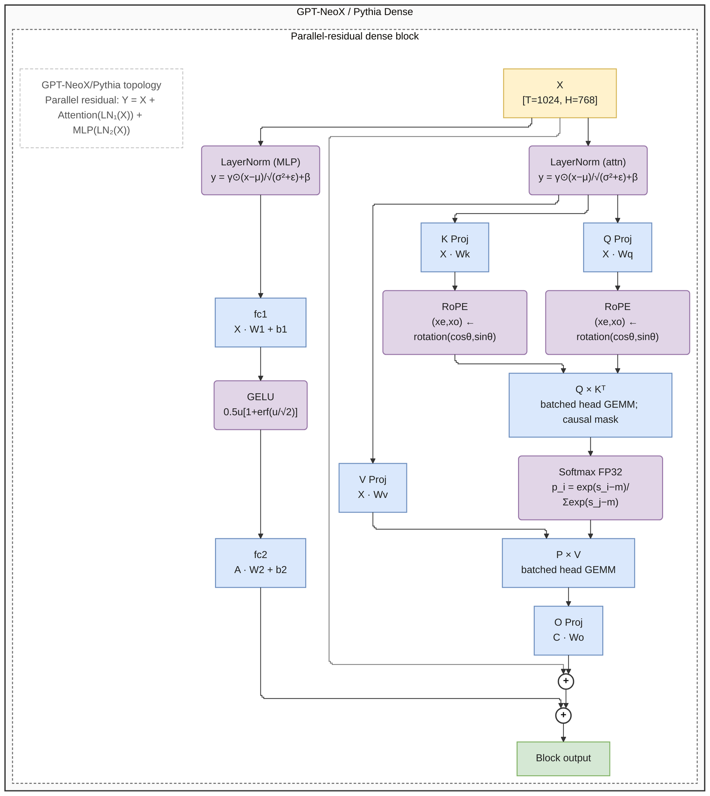

## 16. Gemma 4 MoE

```mermaid
%%{init: {"flowchart": {"defaultRenderer": "elk", "curve": "stepAfter", "htmlLabels": true, "nodeSpacing": 36, "rankSpacing": 48, "useMaxWidth": false}, "theme": "base"}}%%
%% Family rank 16: Gemma 4 MoE
%% 17A_Gemma4_MoE_Sliding: 同构/同拓扑模型 | Representative Gemma 4 MoE family page for Gemma-4-26B-A4B and OTel-LLM-E4B-IT. Sliding block.
%% 17B_Gemma4_MoE_Full: 同构/同拓扑模型 | Representative Gemma 4 MoE family page for Gemma-4-26B-A4B and OTel-LLM-E4B-IT. Global/full block.
flowchart TB
  subgraph family_16["Gemma 4 MoE"]
    direction TB
    subgraph variant_16_01["Sliding-attention + sparse MoE block"]
      direction TB
      subgraph p23_g01["Shared expert body × 1"]
        direction LR
        p23_n032["gate_proj<br/>X · Wg"]:::mac
        p23_n033["up_proj<br/>X · Wu"]:::mac
        p23_n034("GELU-tanh<br/>GELU_tanh(u)"):::other
        p23_n035("Elementwise gate<br/>GELU-tanh(gate) ⊙ up"):::other
        p23_n036["down_proj<br/>Z · Wd"]:::mac
      end
      subgraph p23_g02["Routed expert body × E=64; 8 active/token"]
        direction LR
        p23_n025["gate_proj<br/>X · Wg"]:::mac
        p23_n026["up_proj<br/>X · Wu"]:::mac
        p23_n027("GELU-tanh<br/>GELU_tanh(u)"):::other
        p23_n028("Elementwise gate<br/>GELU-tanh(gate) ⊙ up"):::other
        p23_n029["down_proj<br/>Z · Wd"]:::mac
      end
      p23_n001["X<br/>[T=1024, H=5376]"]:::input
      p23_n003("RMSNorm 1<br/>y = x ⊙ γ / √(mean(x²)+ε)"):::other
      p23_n004["K=V shared Proj<br/>X · Wkv"]:::mac
      p23_n005["Q Proj<br/>X · Wq"]:::mac
      p23_n006("K Head RMSNorm<br/>y = x ⊙ γ / √(mean_d(x²)+ε)"):::other
      p23_n007("Q Head RMSNorm<br/>y = x ⊙ γ / √(mean_d(x²)+ε)"):::other
      p23_n008("RoPE<br/>(xe,xo) ← rotation(cosθ,sinθ)"):::other
      p23_n009("RoPE<br/>(xe,xo) ← rotation(cosθ,sinθ)"):::other
      p23_n010[("K cache")]:::state
      p23_n011[("V cache")]:::state
      p23_n012("K head repeat ×2<br/>view/expand GQA heads"):::other
      p23_n013("V head repeat ×2<br/>view/expand GQA heads"):::other
      p23_n014["Q × Kᵀ<br/>batched head GEMM; causal sliding window W=1024"]:::mac
      p23_n015("Softmax FP32<br/>p_i = exp(s_i−m)/Σj exp(s_j−m)"):::other
      p23_n016["P × V<br/>batched head GEMM"]:::mac
      p23_n017["O Proj<br/>C · Wo"]:::mac
      p23_n018((+)):::plus
      p23_n019["X + Attention"]:::output
      p23_n020("RMSNorm 2<br/>y = x ⊙ γ / √(mean(x²)+ε)"):::other
      p23_n021["Router projection<br/>logits = X · Wrouter"]:::mac
      p23_n022("Router scoring<br/>p = softmax_FP32(logits)"):::other
      p23_n023("Top-8 + renorm<br/>select experts; p ← p/ΣTopK p"):::other
      p23_n024("Dispatch / gather<br/>group token rows by expert_id"):::other
      p23_n037["Shared gate projection<br/>s = X · ws"]:::mac
      p23_n038("Sigmoid<br/>σ(s)"):::other
      p23_n039("Shared gating<br/>σ(s) ⊙ Eshared(X)"):::other
      p23_n030("Expert weighting<br/>p_e ⊙ E_e(X)"):::other
      p23_n031("Scatter / weighted reduce<br/>Yroute = Σe p_e E_e(X)"):::other
      p23_n040((+)):::plus
      p23_n041((+)):::plus
      p23_n002["Attention dimensions<br/>Q=32×256; K/V=16×256; logical score rows=32×T×1024"]:::note
      p23_n042["Block output"]:::output
      p23_n001 --> p23_n003
      p23_n003 --> p23_n004
      p23_n003 --> p23_n005
      p23_n004 --> p23_n006
      p23_n005 --> p23_n007
      p23_n006 --> p23_n008
      p23_n007 --> p23_n009
      p23_n008 --> p23_n010
      p23_n004 -.-> p23_n011
      p23_n010 --> p23_n012
      p23_n011 --> p23_n013
      p23_n009 --> p23_n014
      p23_n012 --> p23_n014
      p23_n014 --> p23_n015
      p23_n015 --> p23_n016
      p23_n013 --> p23_n016
      p23_n016 --> p23_n017
      p23_n017 --> p23_n018
      p23_n001 --> p23_n018
      p23_n018 --> p23_n019
      p23_n019 --> p23_n020
      p23_n025 --> p23_n027
      p23_n027 --> p23_n028
      p23_n026 --> p23_n028
      p23_n028 --> p23_n029
      p23_n020 --> p23_n021
      p23_n021 --> p23_n022
      p23_n022 --> p23_n023
      p23_n023 --> p23_n024
      p23_n024 --> p23_n025
      p23_n024 --> p23_n026
      p23_n029 --> p23_n030
      p23_n023 --> p23_n030
      p23_n030 --> p23_n031
      p23_n032 --> p23_n034
      p23_n034 --> p23_n035
      p23_n033 --> p23_n035
      p23_n035 --> p23_n036
      p23_n020 --> p23_n032
      p23_n020 --> p23_n033
      p23_n020 --> p23_n037
      p23_n037 --> p23_n038
      p23_n038 --> p23_n039
      p23_n036 --> p23_n039
      p23_n031 --> p23_n040
      p23_n039 --> p23_n040
      p23_n040 --> p23_n041
      p23_n041 --> p23_n042
      p23_n019 --> p23_n041
    end
    subgraph variant_16_02["Full-attention + sparse MoE block"]
      direction TB
      subgraph p24_g01["Shared expert body × 1"]
        direction LR
        p24_n032["gate_proj<br/>X · Wg"]:::mac
        p24_n033["up_proj<br/>X · Wu"]:::mac
        p24_n034("GELU-tanh<br/>GELU_tanh(u)"):::other
        p24_n035("Elementwise gate<br/>GELU-tanh(gate) ⊙ up"):::other
        p24_n036["down_proj<br/>Z · Wd"]:::mac
      end
      subgraph p24_g02["Routed expert body × E=64; 8 active/token"]
        direction LR
        p24_n025["gate_proj<br/>X · Wg"]:::mac
        p24_n026["up_proj<br/>X · Wu"]:::mac
        p24_n027("GELU-tanh<br/>GELU_tanh(u)"):::other
        p24_n028("Elementwise gate<br/>GELU-tanh(gate) ⊙ up"):::other
        p24_n029["down_proj<br/>Z · Wd"]:::mac
      end
      p24_n001["X<br/>[T=1024, H=5376]"]:::input
      p24_n003("RMSNorm 1<br/>y = x ⊙ γ / √(mean(x²)+ε)"):::other
      p24_n004["K=V shared Proj<br/>X · Wkv"]:::mac
      p24_n005["Q Proj<br/>X · Wq"]:::mac
      p24_n006("K Head RMSNorm<br/>y = x ⊙ γ / √(mean_d(x²)+ε)"):::other
      p24_n007("Q Head RMSNorm<br/>y = x ⊙ γ / √(mean_d(x²)+ε)"):::other
      p24_n008("Partial RoPE<br/>rotate first 0.25·d dims; pass rest"):::other
      p24_n009("Partial RoPE<br/>rotate first 0.25·d dims; pass rest"):::other
      p24_n010[("K cache")]:::state
      p24_n011[("V cache")]:::state
      p24_n012("K head repeat ×8<br/>view/expand GQA heads"):::other
      p24_n013("V head repeat ×8<br/>view/expand GQA heads"):::other
      p24_n014["Q × Kᵀ<br/>batched head GEMM; causal mask"]:::mac
      p24_n015("Softmax FP32<br/>p_i = exp(s_i−m)/Σj exp(s_j−m)"):::other
      p24_n016["P × V<br/>batched head GEMM"]:::mac
      p24_n017["O Proj<br/>C · Wo"]:::mac
      p24_n018((+)):::plus
      p24_n019["X + Attention"]:::output
      p24_n020("RMSNorm 2<br/>y = x ⊙ γ / √(mean(x²)+ε)"):::other
      p24_n021["Router projection<br/>logits = X · Wrouter"]:::mac
      p24_n022("Router scoring<br/>p = softmax_FP32(logits)"):::other
      p24_n023("Top-8 + renorm<br/>select experts; p ← p/ΣTopK p"):::other
      p24_n024("Dispatch / gather<br/>group token rows by expert_id"):::other
      p24_n037["Shared gate projection<br/>s = X · ws"]:::mac
      p24_n038("Sigmoid<br/>σ(s)"):::other
      p24_n039("Shared gating<br/>σ(s) ⊙ Eshared(X)"):::other
      p24_n030("Expert weighting<br/>p_e ⊙ E_e(X)"):::other
      p24_n031("Scatter / weighted reduce<br/>Yroute = Σe p_e E_e(X)"):::other
      p24_n040((+)):::plus
      p24_n041((+)):::plus
      p24_n002["Attention dimensions<br/>Q=32×512; K/V=4×512; logical score rows=32×T×T"]:::note
      p24_n042["Block output"]:::output
      p24_n001 --> p24_n003
      p24_n003 --> p24_n004
      p24_n003 --> p24_n005
      p24_n004 --> p24_n006
      p24_n005 --> p24_n007
      p24_n006 --> p24_n008
      p24_n007 --> p24_n009
      p24_n008 --> p24_n010
      p24_n004 -.-> p24_n011
      p24_n010 --> p24_n012
      p24_n011 --> p24_n013
      p24_n009 --> p24_n014
      p24_n012 --> p24_n014
      p24_n014 --> p24_n015
      p24_n015 --> p24_n016
      p24_n013 --> p24_n016
      p24_n016 --> p24_n017
      p24_n017 --> p24_n018
      p24_n001 --> p24_n018
      p24_n018 --> p24_n019
      p24_n019 --> p24_n020
      p24_n025 --> p24_n027
      p24_n027 --> p24_n028
      p24_n026 --> p24_n028
      p24_n028 --> p24_n029
      p24_n020 --> p24_n021
      p24_n021 --> p24_n022
      p24_n022 --> p24_n023
      p24_n023 --> p24_n024
      p24_n024 --> p24_n025
      p24_n024 --> p24_n026
      p24_n029 --> p24_n030
      p24_n023 --> p24_n030
      p24_n030 --> p24_n031
      p24_n032 --> p24_n034
      p24_n034 --> p24_n035
      p24_n033 --> p24_n035
      p24_n035 --> p24_n036
      p24_n020 --> p24_n032
      p24_n020 --> p24_n033
      p24_n020 --> p24_n037
      p24_n037 --> p24_n038
      p24_n038 --> p24_n039
      p24_n036 --> p24_n039
      p24_n031 --> p24_n040
      p24_n039 --> p24_n040
      p24_n040 --> p24_n041
      p24_n041 --> p24_n042
      p24_n019 --> p24_n041
    end
  end
style family_16 fill:#fafafa,stroke:#333333,stroke-width:2px;
style p23_g01 fill:#ffffff,stroke:#999999,stroke-width:1px,stroke-dasharray:6 4;
style p23_g02 fill:#ffffff,stroke:#999999,stroke-width:1px,stroke-dasharray:6 4;
style variant_16_01 fill:#ffffff,stroke:#666666,stroke-width:1.5px,stroke-dasharray:4 3;
style p24_g01 fill:#ffffff,stroke:#999999,stroke-width:1px,stroke-dasharray:6 4;
style p24_g02 fill:#ffffff,stroke:#999999,stroke-width:1px,stroke-dasharray:6 4;
style variant_16_02 fill:#ffffff,stroke:#666666,stroke-width:1.5px,stroke-dasharray:4 3;

classDef mac fill:#dae8fc,stroke:#6c8ebf,stroke-width:1.5px,color:#1f1f1f;
classDef other fill:#e1d5e7,stroke:#9673a6,stroke-width:1.5px,color:#1f1f1f;
classDef state fill:#d5e8d4,stroke:#82b366,stroke-width:1.5px,color:#1f1f1f;
classDef output fill:#d5e8d4,stroke:#82b366,stroke-width:1.5px,color:#1f1f1f;
classDef input fill:#fff2cc,stroke:#d6b656,stroke-width:1.5px,color:#1f1f1f;
classDef input2 fill:#ffe6cc,stroke:#d79b00,stroke-width:1.5px,color:#1f1f1f;
classDef weight fill:#f8cecc,stroke:#b85450,stroke-width:1.5px,color:#1f1f1f;
classDef plus fill:#ffffff,stroke:#333333,stroke-width:2px,color:#111111,font-weight:bold;
classDef note fill:#ffffff,stroke:#b3b3b3,stroke-width:1px,stroke-dasharray:5 3,color:#555555;
classDef neutral fill:#ffffff,stroke:#777777,stroke-width:1.2px,color:#333333;
linkStyle default stroke:#333333,stroke-width:1.2px;
linkStyle 8,57 stroke:#82b366,stroke-width:1.5px,stroke-dasharray:5 3;
linkStyle 18,48,67,97 stroke:#777777,stroke-width:1.3px;

```

## 17. Kimi K3 Hybrid MoE

```mermaid
%%{init: {"flowchart": {"defaultRenderer": "elk", "curve": "stepAfter", "htmlLabels": true, "nodeSpacing": 36, "rankSpacing": 48, "useMaxWidth": false}, "theme": "base"}}%%
%% Family rank 17: Kimi K3 Hybrid MoE
%% 18_KimiK3_Hybrid_MLA_MoE: 同构/同拓扑模型 | Representative long-tail Kimi K3 / DSpark family page. Drawn as an MLA + sparse MoE block, the closest public open-weight topology class in the snapshot.
flowchart TB
  subgraph family_17["Kimi K3 Hybrid MoE"]
    direction TB
    subgraph variant_17_01["Representative MLA + sparse MoE block"]
      direction TB
      subgraph p25_g01["Shared expert body × 1"]
        direction LR
        p25_n030["gate_proj<br/>X · Wg"]:::mac
        p25_n031["up_proj<br/>X · Wu"]:::mac
        p25_n032("SiLU<br/>u·σ(u)"):::other
        p25_n033("Elementwise gate<br/>SiLU(gate) ⊙ up"):::other
        p25_n034["down_proj<br/>Z · Wd"]:::mac
      end
      subgraph p25_g02["Routed expert body × E=128; 8 active/token"]
        direction LR
        p25_n023["gate_proj<br/>X · Wg"]:::mac
        p25_n024["up_proj<br/>X · Wu"]:::mac
        p25_n025("SiLU<br/>u·σ(u)"):::other
        p25_n026("Elementwise gate<br/>SiLU(gate) ⊙ up"):::other
        p25_n027["down_proj<br/>Z · Wd"]:::mac
      end
      p25_n001["X<br/>[T=1024,H=7168]"]:::input
      p25_n002("RMSNorm 1<br/>y = x ⊙ γ / √(mean(x²)+ε)"):::other
      p25_n003["Q low-rank A<br/>H → rank1536"]:::mac
      p25_n006["KV compression<br/>H → latent512 + K_rope64"]:::mac
      p25_n004("Q LoRA RMSNorm<br/>y = x ⊙ γ / √(mean(x²)+ε)"):::other
      p25_n007("KV latent RMSNorm<br/>y = x ⊙ γ / √(mean(x²)+ε)"):::other
      p25_n005["Q low-rank B<br/>rank → 128×(128+64)"]:::mac
      p25_n008["KV expansion<br/>latent → K_nope + V128/head"]:::mac
      p25_n009("Split Q<br/>Q_nope128 + Q_rope64"):::other
      p25_n010("Split KV<br/>K_nope128 + K_rope64 + V128"):::other
      p25_n011("YaRN RoPE<br/>apply only 64 rotary dims"):::other
      p25_n012["MLA Q × Kᵀ<br/>128 heads; latent KV reconstruction/fusion"]:::mac
      p25_n013("Softmax FP32<br/>full causal attention"):::other
      p25_n014["P × V<br/>latent/value GEMM"]:::mac
      p25_n015["O Proj<br/>[128×128] → H"]:::mac
      p25_n016((+)):::plus
      p25_n017["X + MLA"]:::output
      p25_n018("RMSNorm 2<br/>y = x ⊙ γ / √(mean(x²)+ε)"):::other
      p25_n019["Router projection<br/>logits = X · Wrouter"]:::mac
      p25_n020("Router scoring<br/>p = sigmoid_FP32(logits)"):::other
      p25_n021("Top-8 + renorm<br/>select experts; p ← p/ΣTopK p"):::other
      p25_n022("Dispatch / gather<br/>group token rows by expert_id"):::other
      p25_n035["Shared gate projection<br/>s = X · ws"]:::mac
      p25_n036("Sigmoid<br/>σ(s)"):::other
      p25_n037("Shared gating<br/>σ(s) ⊙ Eshared(X)"):::other
      p25_n028("Expert weighting<br/>p_e ⊙ E_e(X)"):::other
      p25_n029("Scatter / weighted reduce<br/>Yroute = Σe p_e E_e(X)"):::other
      p25_n038((+)):::plus
      p25_n039((+)):::plus
      p25_n040["Block output"]:::output
      p25_n041["Layer variation<br/>First 3 layers use dense SwiGLU I=18432; later layers use 256 routed experts top-8 + one shared expert."]:::note
      p25_n001 --> p25_n002
      p25_n002 --> p25_n003
      p25_n003 --> p25_n004
      p25_n004 --> p25_n005
      p25_n002 --> p25_n006
      p25_n006 --> p25_n007
      p25_n007 --> p25_n008
      p25_n005 --> p25_n009
      p25_n008 --> p25_n010
      p25_n009 --> p25_n011
      p25_n010 --> p25_n011
      p25_n011 --> p25_n012
      p25_n012 --> p25_n013
      p25_n013 --> p25_n014
      p25_n014 --> p25_n015
      p25_n015 --> p25_n016
      p25_n001 --> p25_n016
      p25_n016 --> p25_n017
      p25_n017 --> p25_n018
      p25_n023 --> p25_n025
      p25_n025 --> p25_n026
      p25_n024 --> p25_n026
      p25_n026 --> p25_n027
      p25_n018 --> p25_n019
      p25_n019 --> p25_n020
      p25_n020 --> p25_n021
      p25_n021 --> p25_n022
      p25_n022 --> p25_n023
      p25_n022 --> p25_n024
      p25_n027 --> p25_n028
      p25_n021 --> p25_n028
      p25_n028 --> p25_n029
      p25_n030 --> p25_n032
      p25_n032 --> p25_n033
      p25_n031 --> p25_n033
      p25_n033 --> p25_n034
      p25_n018 --> p25_n030
      p25_n018 --> p25_n031
      p25_n018 --> p25_n035
      p25_n035 --> p25_n036
      p25_n036 --> p25_n037
      p25_n034 --> p25_n037
      p25_n029 --> p25_n038
      p25_n037 --> p25_n038
      p25_n038 --> p25_n039
      p25_n039 --> p25_n040
      p25_n017 --> p25_n039
    end
  end
style family_17 fill:#fafafa,stroke:#333333,stroke-width:2px;
style p25_g01 fill:#ffffff,stroke:#999999,stroke-width:1px,stroke-dasharray:6 4;
style p25_g02 fill:#ffffff,stroke:#999999,stroke-width:1px,stroke-dasharray:6 4;
style variant_17_01 fill:#ffffff,stroke:#666666,stroke-width:1.5px,stroke-dasharray:4 3;

classDef mac fill:#dae8fc,stroke:#6c8ebf,stroke-width:1.5px,color:#1f1f1f;
classDef other fill:#e1d5e7,stroke:#9673a6,stroke-width:1.5px,color:#1f1f1f;
classDef state fill:#d5e8d4,stroke:#82b366,stroke-width:1.5px,color:#1f1f1f;
classDef output fill:#d5e8d4,stroke:#82b366,stroke-width:1.5px,color:#1f1f1f;
classDef input fill:#fff2cc,stroke:#d6b656,stroke-width:1.5px,color:#1f1f1f;
classDef input2 fill:#ffe6cc,stroke:#d79b00,stroke-width:1.5px,color:#1f1f1f;
classDef weight fill:#f8cecc,stroke:#b85450,stroke-width:1.5px,color:#1f1f1f;
classDef plus fill:#ffffff,stroke:#333333,stroke-width:2px,color:#111111,font-weight:bold;
classDef note fill:#ffffff,stroke:#b3b3b3,stroke-width:1px,stroke-dasharray:5 3,color:#555555;
classDef neutral fill:#ffffff,stroke:#777777,stroke-width:1.2px,color:#333333;
linkStyle default stroke:#333333,stroke-width:1.2px;
linkStyle 16,46 stroke:#777777,stroke-width:1.3px;

```

## 18. Granite 4 Hybrid

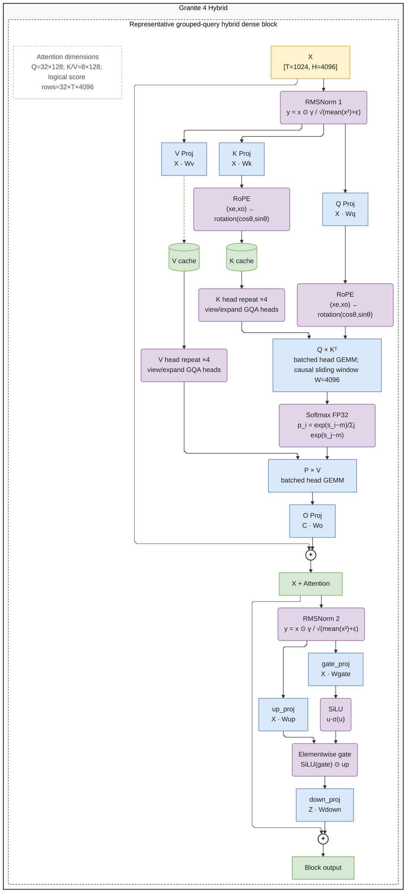

## 19. Qwen1 Dense

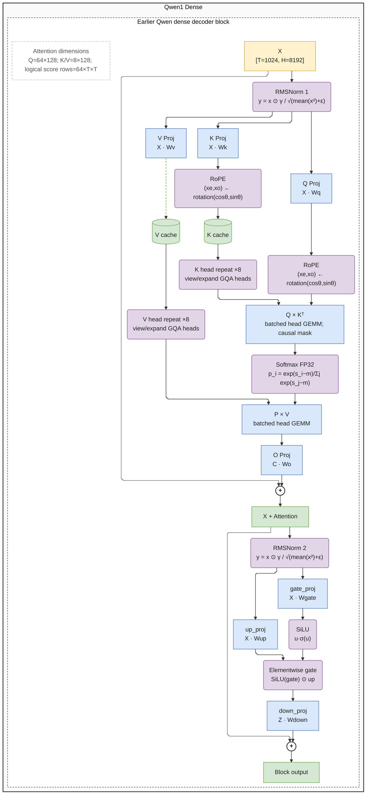

## 20. Phi-2 Dense

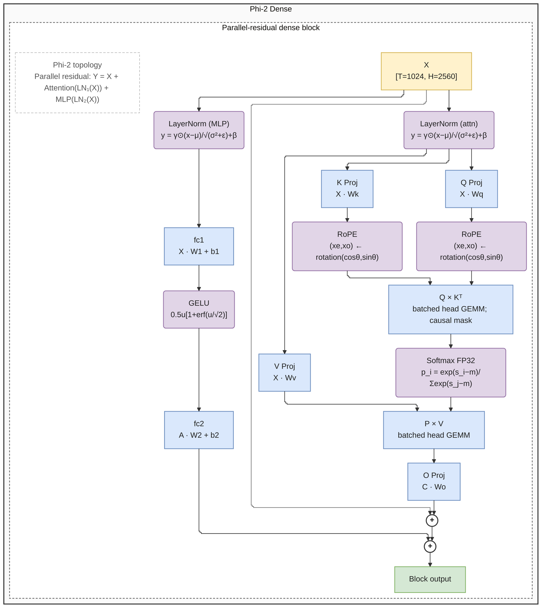

## 21. BLOOM Dense

```mermaid
%%{init: {"flowchart": {"defaultRenderer": "elk", "curve": "stepAfter", "htmlLabels": true, "nodeSpacing": 36, "rankSpacing": 48, "useMaxWidth": false}, "theme": "base"}}%%
%% Family rank 21: BLOOM Dense
%% 22_BLOOM_Dense: 同构/同拓扑模型 | BLOOM/BLOOMZ representative page. Uses the Megatron-style dense decoder block with combined QKV projection, causal self-attention and GELU FFN.
flowchart TB
  subgraph family_21["BLOOM Dense"]
    direction TB
    subgraph variant_21_01["Megatron-style dense decoder block"]
      direction TB
      p29_n001["X<br/>[T=1024, H=1024]"]:::input
      p29_n002("Learned absolute position<br/>X ← token_embed + pos_embed"):::other
      p29_n003("LayerNorm 1<br/>y = γ⊙(x−μ)/√(σ²+ε)+β"):::other
      p29_n004["Combined QKV Proj<br/>X · Wqkv + bqkv"]:::mac
      p29_n005("Split heads<br/>reshape Q/K/V"):::other
      p29_n006["Q × Kᵀ<br/>MHA score GEMM + causal mask"]:::mac
      p29_n007("Softmax FP32<br/>p_i=exp(s_i−m)/Σexp(s_j−m)"):::other
      p29_n008["P × V<br/>batched head GEMM"]:::mac
      p29_n009["Output Proj<br/>C·Wo+bo"]:::mac
      p29_n010((+)):::plus
      p29_n011["X + Attention"]:::output
      p29_n012("LayerNorm 2<br/>y = γ⊙(x−μ)/√(σ²+ε)+β"):::other
      p29_n013["fc1<br/>X · W1 + b1"]:::mac
      p29_n014("GELU<br/>GELU(x)"):::other
      p29_n015["fc2<br/>A · W2 + b2"]:::mac
      p29_n016((+)):::plus
      p29_n017["Block output"]:::output
      p29_n001 --> p29_n002
      p29_n002 --> p29_n003
      p29_n003 --> p29_n004
      p29_n004 --> p29_n005
      p29_n005 --> p29_n006
      p29_n005 --> p29_n006
      p29_n006 --> p29_n007
      p29_n007 --> p29_n008
      p29_n005 --> p29_n008
      p29_n008 --> p29_n009
      p29_n009 --> p29_n010
      p29_n002 --> p29_n010
      p29_n010 --> p29_n011
      p29_n011 --> p29_n012
      p29_n012 --> p29_n013
      p29_n013 --> p29_n014
      p29_n014 --> p29_n015
      p29_n015 --> p29_n016
      p29_n016 --> p29_n017
      p29_n011 --> p29_n016
    end
  end
style family_21 fill:#fafafa,stroke:#333333,stroke-width:2px;
style variant_21_01 fill:#ffffff,stroke:#666666,stroke-width:1.5px,stroke-dasharray:4 3;

classDef mac fill:#dae8fc,stroke:#6c8ebf,stroke-width:1.5px,color:#1f1f1f;
classDef other fill:#e1d5e7,stroke:#9673a6,stroke-width:1.5px,color:#1f1f1f;
classDef state fill:#d5e8d4,stroke:#82b366,stroke-width:1.5px,color:#1f1f1f;
classDef output fill:#d5e8d4,stroke:#82b366,stroke-width:1.5px,color:#1f1f1f;
classDef input fill:#fff2cc,stroke:#d6b656,stroke-width:1.5px,color:#1f1f1f;
classDef input2 fill:#ffe6cc,stroke:#d79b00,stroke-width:1.5px,color:#1f1f1f;
classDef weight fill:#f8cecc,stroke:#b85450,stroke-width:1.5px,color:#1f1f1f;
classDef plus fill:#ffffff,stroke:#333333,stroke-width:2px,color:#111111,font-weight:bold;
classDef note fill:#ffffff,stroke:#b3b3b3,stroke-width:1px,stroke-dasharray:5 3,color:#555555;
classDef neutral fill:#ffffff,stroke:#777777,stroke-width:1.2px,color:#333333;
linkStyle default stroke:#333333,stroke-width:1.2px;
linkStyle 11,19 stroke:#777777,stroke-width:1.3px;

```

## 22. OpenELM Dense

```mermaid
%%{init: {"flowchart": {"defaultRenderer": "elk", "curve": "stepAfter", "htmlLabels": true, "nodeSpacing": 36, "rankSpacing": 48, "useMaxWidth": false}, "theme": "base"}}%%
%% Family rank 22: OpenELM Dense
%% 23_OpenELM_Dense: 同构/同拓扑模型 | Representative OpenELM family page. Uses compact grouped-query attention plus SwiGLU.
flowchart TB
  subgraph family_22["OpenELM Dense"]
    direction TB
    subgraph variant_22_01["Compact GQA + SwiGLU block"]
      direction TB
      p30_n001["X<br/>[T=1024, H=2048]"]:::input
      p30_n002("RMSNorm 1<br/>y = x ⊙ γ / √(mean(x²)+ε)"):::other
      p30_n003["K Proj<br/>X · Wk"]:::mac
      p30_n004["Q Proj<br/>X · Wq"]:::mac
      p30_n005["V Proj<br/>X · Wv"]:::mac
      p30_n006("RoPE<br/>(xe,xo) ← rotation(cosθ,sinθ)"):::other
      p30_n007("RoPE<br/>(xe,xo) ← rotation(cosθ,sinθ)"):::other
      p30_n008[("K cache")]:::state
      p30_n009[("V cache")]:::state
      p30_n010("K head repeat ×4<br/>view/expand GQA heads"):::other
      p30_n011("V head repeat ×4<br/>view/expand GQA heads"):::other
      p30_n012["Q × Kᵀ<br/>batched head GEMM; causal mask"]:::mac
      p30_n013("Softmax FP32<br/>p_i = exp(s_i−m)/Σj exp(s_j−m)"):::other
      p30_n014["P × V<br/>batched head GEMM"]:::mac
      p30_n015["O Proj<br/>C · Wo"]:::mac
      p30_n016((+)):::plus
      p30_n017["X + Attention"]:::output
      p30_n018("RMSNorm 2<br/>y = x ⊙ γ / √(mean(x²)+ε)"):::other
      p30_n019["gate_proj<br/>X · Wgate"]:::mac
      p30_n020["up_proj<br/>X · Wup"]:::mac
      p30_n021("SiLU<br/>u·σ(u)"):::other
      p30_n022("Elementwise gate<br/>SiLU(gate) ⊙ up"):::other
      p30_n023["down_proj<br/>Z · Wdown"]:::mac
      p30_n024((+)):::plus
      p30_n025["Block output"]:::output
      p30_n026["Attention dimensions<br/>Q=16×128; K/V=4×128; logical score rows=16×T×T"]:::note
      p30_n001 --> p30_n002
      p30_n002 --> p30_n003
      p30_n002 --> p30_n004
      p30_n002 --> p30_n005
      p30_n003 --> p30_n006
      p30_n004 --> p30_n007
      p30_n006 --> p30_n008
      p30_n005 -.-> p30_n009
      p30_n008 --> p30_n010
      p30_n009 --> p30_n011
      p30_n007 --> p30_n012
      p30_n010 --> p30_n012
      p30_n012 --> p30_n013
      p30_n013 --> p30_n014
      p30_n011 --> p30_n014
      p30_n014 --> p30_n015
      p30_n015 --> p30_n016
      p30_n001 --> p30_n016
      p30_n016 --> p30_n017
      p30_n017 --> p30_n018
      p30_n018 --> p30_n019
      p30_n018 --> p30_n020
      p30_n019 --> p30_n021
      p30_n021 --> p30_n022
      p30_n020 --> p30_n022
      p30_n022 --> p30_n023
      p30_n023 --> p30_n024
      p30_n024 --> p30_n025
      p30_n017 --> p30_n024
    end
  end
style family_22 fill:#fafafa,stroke:#333333,stroke-width:2px;
style variant_22_01 fill:#ffffff,stroke:#666666,stroke-width:1.5px,stroke-dasharray:4 3;

classDef mac fill:#dae8fc,stroke:#6c8ebf,stroke-width:1.5px,color:#1f1f1f;
classDef other fill:#e1d5e7,stroke:#9673a6,stroke-width:1.5px,color:#1f1f1f;
classDef state fill:#d5e8d4,stroke:#82b366,stroke-width:1.5px,color:#1f1f1f;
classDef output fill:#d5e8d4,stroke:#82b366,stroke-width:1.5px,color:#1f1f1f;
classDef input fill:#fff2cc,stroke:#d6b656,stroke-width:1.5px,color:#1f1f1f;
classDef input2 fill:#ffe6cc,stroke:#d79b00,stroke-width:1.5px,color:#1f1f1f;
classDef weight fill:#f8cecc,stroke:#b85450,stroke-width:1.5px,color:#1f1f1f;
classDef plus fill:#ffffff,stroke:#333333,stroke-width:2px,color:#111111,font-weight:bold;
classDef note fill:#ffffff,stroke:#b3b3b3,stroke-width:1px,stroke-dasharray:5 3,color:#555555;
classDef neutral fill:#ffffff,stroke:#777777,stroke-width:1.2px,color:#333333;
linkStyle default stroke:#333333,stroke-width:1.2px;
linkStyle 7 stroke:#82b366,stroke-width:1.5px,stroke-dasharray:5 3;
linkStyle 17,28 stroke:#777777,stroke-width:1.3px;

```

## 23. PowerMoE

```mermaid
%%{init: {"flowchart": {"defaultRenderer": "elk", "curve": "stepAfter", "htmlLabels": true, "nodeSpacing": 36, "rankSpacing": 48, "useMaxWidth": false}, "theme": "base"}}%%
%% Family rank 23: PowerMoE
%% 24_PowerMoE: 同构/同拓扑模型 | Representative IBM PowerMoE family page. Standard self-attention followed by sparse top-k MoE.
flowchart TB
  subgraph family_23["PowerMoE"]
    direction TB
    subgraph variant_23_01["Attention + sparse MoE block"]
      direction TB
      subgraph p31_g01["Routed expert body × E=64; 4 active/token"]
        direction LR
        p31_n023["gate_proj<br/>X · Wg"]:::mac
        p31_n024["up_proj<br/>X · Wu"]:::mac
        p31_n025("SiLU<br/>u·σ(u)"):::other
        p31_n026("Elementwise gate<br/>SiLU(gate) ⊙ up"):::other
        p31_n027["down_proj<br/>Z · Wd"]:::mac
      end
      p31_n001["X<br/>[T=1024, H=2048]"]:::input
      p31_n002("RMSNorm 1<br/>y = x ⊙ γ / √(mean(x²)+ε)"):::other
      p31_n003["K Proj<br/>X · Wk"]:::mac
      p31_n004["Q Proj<br/>X · Wq"]:::mac
      p31_n005["V Proj<br/>X · Wv"]:::mac
      p31_n006("RoPE<br/>(xe,xo) ← rotation(cosθ,sinθ)"):::other
      p31_n007("RoPE<br/>(xe,xo) ← rotation(cosθ,sinθ)"):::other
      p31_n008[("K cache")]:::state
      p31_n009[("V cache")]:::state
      p31_n010("K head repeat ×4<br/>view/expand GQA heads"):::other
      p31_n011("V head repeat ×4<br/>view/expand GQA heads"):::other
      p31_n012["Q × Kᵀ<br/>batched head GEMM; causal mask"]:::mac
      p31_n013("Softmax FP32<br/>p_i = exp(s_i−m)/Σj exp(s_j−m)"):::other
      p31_n014["P × V<br/>batched head GEMM"]:::mac
      p31_n015["O Proj<br/>C · Wo"]:::mac
      p31_n016((+)):::plus
      p31_n017["X + Attention"]:::output
      p31_n018("RMSNorm 2<br/>y = x ⊙ γ / √(mean(x²)+ε)"):::other
      p31_n019["Router projection<br/>logits = X · Wrouter"]:::mac
      p31_n020("Router scoring<br/>p = softmax_FP32(logits)"):::other
      p31_n021("Top-4 + renorm<br/>select experts; p ← p/ΣTopK p"):::other
      p31_n022("Dispatch / gather<br/>group token rows by expert_id"):::other
      p31_n028("Expert weighting<br/>p_e ⊙ E_e(X)"):::other
      p31_n029("Scatter / weighted reduce<br/>Yroute = Σe p_e E_e(X)"):::other
      p31_n030((+)):::plus
      p31_n032["Attention dimensions<br/>Q=32×64; K/V=8×64; logical score rows=32×T×T"]:::note
      p31_n031["Block output"]:::output
      p31_n001 --> p31_n002
      p31_n002 --> p31_n003
      p31_n002 --> p31_n004
      p31_n002 --> p31_n005
      p31_n003 --> p31_n006
      p31_n004 --> p31_n007
      p31_n006 --> p31_n008
      p31_n005 -.-> p31_n009
      p31_n008 --> p31_n010
      p31_n009 --> p31_n011
      p31_n007 --> p31_n012
      p31_n010 --> p31_n012
      p31_n012 --> p31_n013
      p31_n013 --> p31_n014
      p31_n011 --> p31_n014
      p31_n014 --> p31_n015
      p31_n015 --> p31_n016
      p31_n001 --> p31_n016
      p31_n016 --> p31_n017
      p31_n017 --> p31_n018
      p31_n023 --> p31_n025
      p31_n025 --> p31_n026
      p31_n024 --> p31_n026
      p31_n026 --> p31_n027
      p31_n018 --> p31_n019
      p31_n019 --> p31_n020
      p31_n020 --> p31_n021
      p31_n021 --> p31_n022
      p31_n022 --> p31_n023
      p31_n022 --> p31_n024
      p31_n027 --> p31_n028
      p31_n021 --> p31_n028
      p31_n028 --> p31_n029
      p31_n029 --> p31_n030
      p31_n030 --> p31_n031
      p31_n017 --> p31_n030
    end
  end
style family_23 fill:#fafafa,stroke:#333333,stroke-width:2px;
style p31_g01 fill:#ffffff,stroke:#999999,stroke-width:1px,stroke-dasharray:6 4;
style variant_23_01 fill:#ffffff,stroke:#666666,stroke-width:1.5px,stroke-dasharray:4 3;

classDef mac fill:#dae8fc,stroke:#6c8ebf,stroke-width:1.5px,color:#1f1f1f;
classDef other fill:#e1d5e7,stroke:#9673a6,stroke-width:1.5px,color:#1f1f1f;
classDef state fill:#d5e8d4,stroke:#82b366,stroke-width:1.5px,color:#1f1f1f;
classDef output fill:#d5e8d4,stroke:#82b366,stroke-width:1.5px,color:#1f1f1f;
classDef input fill:#fff2cc,stroke:#d6b656,stroke-width:1.5px,color:#1f1f1f;
classDef input2 fill:#ffe6cc,stroke:#d79b00,stroke-width:1.5px,color:#1f1f1f;
classDef weight fill:#f8cecc,stroke:#b85450,stroke-width:1.5px,color:#1f1f1f;
classDef plus fill:#ffffff,stroke:#333333,stroke-width:2px,color:#111111,font-weight:bold;
classDef note fill:#ffffff,stroke:#b3b3b3,stroke-width:1px,stroke-dasharray:5 3,color:#555555;
classDef neutral fill:#ffffff,stroke:#777777,stroke-width:1.2px,color:#333333;
linkStyle default stroke:#333333,stroke-width:1.2px;
linkStyle 7 stroke:#82b366,stroke-width:1.5px,stroke-dasharray:5 3;
linkStyle 17,35 stroke:#777777,stroke-width:1.3px;

```

## 24. Nemotron 3 Hybrid MoE

```mermaid
%%{init: {"flowchart": {"defaultRenderer": "elk", "curve": "stepAfter", "htmlLabels": true, "nodeSpacing": 36, "rankSpacing": 48, "useMaxWidth": false}, "theme": "base"}}%%
%% Family rank 24: Nemotron 3 Hybrid MoE
%% 25_Nemotron3_Hybrid_MoE: 同构/同拓扑模型 | Representative NVIDIA Nemotron3 hybrid MoE family page. Drawn with long-context attention plus sparse MoE at the same abstraction level as other atlas pages.
flowchart TB
  subgraph family_24["Nemotron 3 Hybrid MoE"]
    direction TB
    subgraph variant_24_01["Representative long-context sparse MoE block"]
      direction TB
      subgraph p32_g01["Shared expert body × 1"]
        direction LR
        p32_n031["gate_proj<br/>X · Wg"]:::mac
        p32_n032["up_proj<br/>X · Wu"]:::mac
        p32_n033("SiLU<br/>u·σ(u)"):::other
        p32_n034("Elementwise gate<br/>SiLU(gate) ⊙ up"):::other
        p32_n035["down_proj<br/>Z · Wd"]:::mac
      end
      subgraph p32_g02["Routed expert body × E=128; 8 active/token"]
        direction LR
        p32_n024["gate_proj<br/>X · Wg"]:::mac
        p32_n025["up_proj<br/>X · Wu"]:::mac
        p32_n026("SiLU<br/>u·σ(u)"):::other
        p32_n027("Elementwise gate<br/>SiLU(gate) ⊙ up"):::other
        p32_n028["down_proj<br/>Z · Wd"]:::mac
      end
      p32_n001["X<br/>[T=1024, H=6144]"]:::input
      p32_n003("RMSNorm 1<br/>y = x ⊙ γ / √(mean(x²)+ε)"):::other
      p32_n004["K Proj<br/>X · Wk"]:::mac
      p32_n005["Q Proj<br/>X · Wq"]:::mac
      p32_n006["V Proj<br/>X · Wv"]:::mac
      p32_n007("RoPE<br/>(xe,xo) ← rotation(cosθ,sinθ)"):::other
      p32_n008("RoPE<br/>(xe,xo) ← rotation(cosθ,sinθ)"):::other
      p32_n009[("K cache")]:::state
      p32_n010[("V cache")]:::state
      p32_n011("K head repeat ×6<br/>view/expand GQA heads"):::other
      p32_n012("V head repeat ×6<br/>view/expand GQA heads"):::other
      p32_n013["Q × Kᵀ<br/>batched head GEMM; causal mask"]:::mac
      p32_n014("Softmax FP32<br/>p_i = exp(s_i−m)/Σj exp(s_j−m)"):::other
      p32_n015["P × V<br/>batched head GEMM"]:::mac
      p32_n016["O Proj<br/>C · Wo"]:::mac
      p32_n017((+)):::plus
      p32_n018["X + Attention"]:::output
      p32_n019("RMSNorm 2<br/>y = x ⊙ γ / √(mean(x²)+ε)"):::other
      p32_n020["Router projection<br/>logits = X · Wrouter"]:::mac
      p32_n021("Router scoring<br/>p = softmax_FP32(logits)"):::other
      p32_n022("Top-8 + renorm<br/>select experts; p ← p/ΣTopK p"):::other
      p32_n023("Dispatch / gather<br/>group token rows by expert_id"):::other
      p32_n036["Shared gate projection<br/>s = X · ws"]:::mac
      p32_n037("Sigmoid<br/>σ(s)"):::other
      p32_n038("Shared gating<br/>σ(s) ⊙ Eshared(X)"):::other
      p32_n029("Expert weighting<br/>p_e ⊙ E_e(X)"):::other
      p32_n030("Scatter / weighted reduce<br/>Yroute = Σe p_e E_e(X)"):::other
      p32_n039((+)):::plus
      p32_n040((+)):::plus
      p32_n002["Attention dimensions<br/>Q=48×128; K/V=8×128; logical score rows=48×T×T"]:::note
      p32_n041["Block output"]:::output
      p32_n001 --> p32_n003
      p32_n003 --> p32_n004
      p32_n003 --> p32_n005
      p32_n003 --> p32_n006
      p32_n004 --> p32_n007
      p32_n005 --> p32_n008
      p32_n007 --> p32_n009
      p32_n006 -.-> p32_n010
      p32_n009 --> p32_n011
      p32_n010 --> p32_n012
      p32_n008 --> p32_n013
      p32_n011 --> p32_n013
      p32_n013 --> p32_n014
      p32_n014 --> p32_n015
      p32_n012 --> p32_n015
      p32_n015 --> p32_n016
      p32_n016 --> p32_n017
      p32_n001 --> p32_n017
      p32_n017 --> p32_n018
      p32_n018 --> p32_n019
      p32_n024 --> p32_n026
      p32_n026 --> p32_n027
      p32_n025 --> p32_n027
      p32_n027 --> p32_n028
      p32_n019 --> p32_n020
      p32_n020 --> p32_n021
      p32_n021 --> p32_n022
      p32_n022 --> p32_n023
      p32_n023 --> p32_n024
      p32_n023 --> p32_n025
      p32_n028 --> p32_n029
      p32_n022 --> p32_n029
      p32_n029 --> p32_n030
      p32_n031 --> p32_n033
      p32_n033 --> p32_n034
      p32_n032 --> p32_n034
      p32_n034 --> p32_n035
      p32_n019 --> p32_n031
      p32_n019 --> p32_n032
      p32_n019 --> p32_n036
      p32_n036 --> p32_n037
      p32_n037 --> p32_n038
      p32_n035 --> p32_n038
      p32_n030 --> p32_n039
      p32_n038 --> p32_n039
      p32_n039 --> p32_n040
      p32_n040 --> p32_n041
      p32_n018 --> p32_n040
    end
  end
style family_24 fill:#fafafa,stroke:#333333,stroke-width:2px;
style p32_g01 fill:#ffffff,stroke:#999999,stroke-width:1px,stroke-dasharray:6 4;
style p32_g02 fill:#ffffff,stroke:#999999,stroke-width:1px,stroke-dasharray:6 4;
style variant_24_01 fill:#ffffff,stroke:#666666,stroke-width:1.5px,stroke-dasharray:4 3;

classDef mac fill:#dae8fc,stroke:#6c8ebf,stroke-width:1.5px,color:#1f1f1f;
classDef other fill:#e1d5e7,stroke:#9673a6,stroke-width:1.5px,color:#1f1f1f;
classDef state fill:#d5e8d4,stroke:#82b366,stroke-width:1.5px,color:#1f1f1f;
classDef output fill:#d5e8d4,stroke:#82b366,stroke-width:1.5px,color:#1f1f1f;
classDef input fill:#fff2cc,stroke:#d6b656,stroke-width:1.5px,color:#1f1f1f;
classDef input2 fill:#ffe6cc,stroke:#d79b00,stroke-width:1.5px,color:#1f1f1f;
classDef weight fill:#f8cecc,stroke:#b85450,stroke-width:1.5px,color:#1f1f1f;
classDef plus fill:#ffffff,stroke:#333333,stroke-width:2px,color:#111111,font-weight:bold;
classDef note fill:#ffffff,stroke:#b3b3b3,stroke-width:1px,stroke-dasharray:5 3,color:#555555;
classDef neutral fill:#ffffff,stroke:#777777,stroke-width:1.2px,color:#333333;
linkStyle default stroke:#333333,stroke-width:1.2px;
linkStyle 7 stroke:#82b366,stroke-width:1.5px,stroke-dasharray:5 3;
linkStyle 17,47 stroke:#777777,stroke-width:1.3px;

```

## 25. Mistral Dense

```mermaid
%%{init: {"flowchart": {"defaultRenderer": "elk", "curve": "stepAfter", "htmlLabels": true, "nodeSpacing": 36, "rankSpacing": 48, "useMaxWidth": false}, "theme": "base"}}%%
%% Family rank 25: Mistral Dense
%% 26_Mistral_Dense: 同构/同拓扑模型 | Mistral-7B and instruct derivatives share sliding-window grouped-query attention plus SwiGLU.
flowchart TB
  subgraph family_25["Mistral Dense"]
    direction TB
    subgraph variant_25_01["Sliding-window GQA + SwiGLU block"]
      direction TB
      p33_n001["X<br/>[T=1024, H=4096]"]:::input
      p33_n002("RMSNorm 1<br/>y = x ⊙ γ / √(mean(x²)+ε)"):::other
      p33_n003["K Proj<br/>X · Wk"]:::mac
      p33_n004["Q Proj<br/>X · Wq"]:::mac
      p33_n005["V Proj<br/>X · Wv"]:::mac
      p33_n006("RoPE<br/>(xe,xo) ← rotation(cosθ,sinθ)"):::other
      p33_n007("RoPE<br/>(xe,xo) ← rotation(cosθ,sinθ)"):::other
      p33_n008[("K cache")]:::state
      p33_n009[("V cache")]:::state
      p33_n010("K head repeat ×4<br/>view/expand GQA heads"):::other
      p33_n011("V head repeat ×4<br/>view/expand GQA heads"):::other
      p33_n012["Q × Kᵀ<br/>batched head GEMM; causal sliding window W=4096"]:::mac
      p33_n013("Softmax FP32<br/>p_i = exp(s_i−m)/Σj exp(s_j−m)"):::other
      p33_n014["P × V<br/>batched head GEMM"]:::mac
      p33_n015["O Proj<br/>C · Wo"]:::mac
      p33_n016((+)):::plus
      p33_n017["X + Attention"]:::output
      p33_n018("RMSNorm 2<br/>y = x ⊙ γ / √(mean(x²)+ε)"):::other
      p33_n019["gate_proj<br/>X · Wgate"]:::mac
      p33_n020["up_proj<br/>X · Wup"]:::mac
      p33_n021("SiLU<br/>u·σ(u)"):::other
      p33_n022("Elementwise gate<br/>SiLU(gate) ⊙ up"):::other
      p33_n023["down_proj<br/>Z · Wdown"]:::mac
      p33_n024((+)):::plus
      p33_n025["Block output"]:::output
      p33_n026["Attention dimensions<br/>Q=32×128; K/V=8×128; logical score rows=32×T×4096"]:::note
      p33_n001 --> p33_n002
      p33_n002 --> p33_n003
      p33_n002 --> p33_n004
      p33_n002 --> p33_n005
      p33_n003 --> p33_n006
      p33_n004 --> p33_n007
      p33_n006 --> p33_n008
      p33_n005 -.-> p33_n009
      p33_n008 --> p33_n010
      p33_n009 --> p33_n011
      p33_n007 --> p33_n012
      p33_n010 --> p33_n012
      p33_n012 --> p33_n013
      p33_n013 --> p33_n014
      p33_n011 --> p33_n014
      p33_n014 --> p33_n015
      p33_n015 --> p33_n016
      p33_n001 --> p33_n016
      p33_n016 --> p33_n017
      p33_n017 --> p33_n018
      p33_n018 --> p33_n019
      p33_n018 --> p33_n020
      p33_n019 --> p33_n021
      p33_n021 --> p33_n022
      p33_n020 --> p33_n022
      p33_n022 --> p33_n023
      p33_n023 --> p33_n024
      p33_n024 --> p33_n025
      p33_n017 --> p33_n024
    end
  end
style family_25 fill:#fafafa,stroke:#333333,stroke-width:2px;
style variant_25_01 fill:#ffffff,stroke:#666666,stroke-width:1.5px,stroke-dasharray:4 3;

classDef mac fill:#dae8fc,stroke:#6c8ebf,stroke-width:1.5px,color:#1f1f1f;
classDef other fill:#e1d5e7,stroke:#9673a6,stroke-width:1.5px,color:#1f1f1f;
classDef state fill:#d5e8d4,stroke:#82b366,stroke-width:1.5px,color:#1f1f1f;
classDef output fill:#d5e8d4,stroke:#82b366,stroke-width:1.5px,color:#1f1f1f;
classDef input fill:#fff2cc,stroke:#d6b656,stroke-width:1.5px,color:#1f1f1f;
classDef input2 fill:#ffe6cc,stroke:#d79b00,stroke-width:1.5px,color:#1f1f1f;
classDef weight fill:#f8cecc,stroke:#b85450,stroke-width:1.5px,color:#1f1f1f;
classDef plus fill:#ffffff,stroke:#333333,stroke-width:2px,color:#111111,font-weight:bold;
classDef note fill:#ffffff,stroke:#b3b3b3,stroke-width:1px,stroke-dasharray:5 3,color:#555555;
classDef neutral fill:#ffffff,stroke:#777777,stroke-width:1.2px,color:#333333;
linkStyle default stroke:#333333,stroke-width:1.2px;
linkStyle 7 stroke:#82b366,stroke-width:1.5px,stroke-dasharray:5 3;
linkStyle 17,28 stroke:#777777,stroke-width:1.3px;

```
